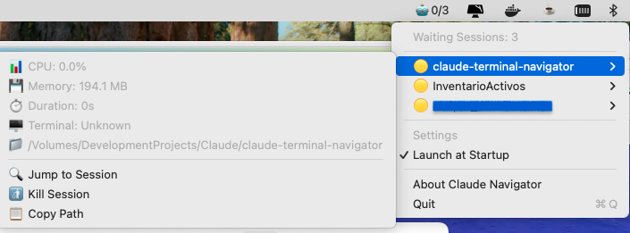
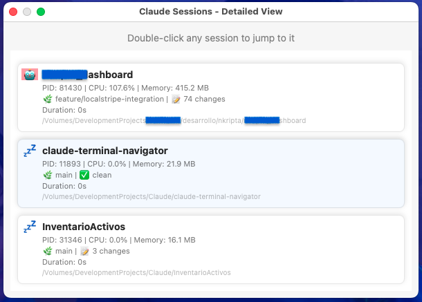

# Claude Terminal Navigator

A macOS menu bar app that helps you navigate between active Claude CLI sessions.

## What it does

- **Automatically detects** all running Claude sessions
- **Shows real-time info**: CPU usage, memory, Git branch, session duration
- **Jump to any session** with a double-click
- **Works with Terminal.app** - click and it switches to the right tab

## Installation

1. Go to [Releases](https://github.com/GailenTech/claude-terminal-navigator/releases/latest)
2. Download `ClaudeNavigator-latest.zip`
3. Unzip and drag `ClaudeNavigator.app` to Applications
4. Launch the app - you'll see a 🤖 icon in your menu bar

## Usage

### Quick Menu
Click the 🤖 icon to see all active sessions with CPU usage and basic info.



### Detailed View
Option+click the 🤖 icon for detailed session information including Git status and full paths.



### Navigation
- **Click any session** to jump to that terminal tab
- **🤖** = active session (high CPU usage)
- **💤** = waiting session (idle)
- **Git info** shows current branch and uncommitted changes

### Settings
- Right-click the menu bar icon for settings
- Enable "Launch at Startup" to auto-start with macOS

## Requirements

- macOS 11.0 or later
- Claude CLI installed
- Terminal.app (built-in macOS terminal)

## Build from Source

```bash
git clone https://github.com/GailenTech/claude-terminal-navigator.git
cd claude-terminal-navigator
./build.sh
cp -r ClaudeNavigator.app /Applications/
```

## Changelog

See [CHANGELOG.md](CHANGELOG.md) for version history.

## License

MIT License - see [LICENSE](LICENSE) file for details.