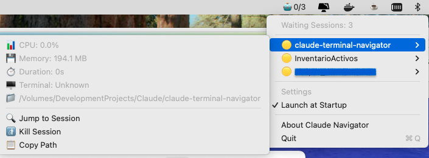

This file is a merged representation of a subset of the codebase, containing files not matching ignore patterns, combined into a single document by Repomix.
The content has been processed where empty lines have been removed, content has been compressed (code blocks are separated by ⋮---- delimiter).

# File Summary

## Purpose
This file contains a packed representation of the entire repository's contents.
It is designed to be easily consumable by AI systems for analysis, code review,
or other automated processes.

## File Format
The content is organized as follows:
1. This summary section
2. Repository information
3. Directory structure
4. Repository files (if enabled)
5. Multiple file entries, each consisting of:
  a. A header with the file path (## File: path/to/file)
  b. The full contents of the file in a code block

## Usage Guidelines
- This file should be treated as read-only. Any changes should be made to the
  original repository files, not this packed version.
- When processing this file, use the file path to distinguish
  between different files in the repository.
- Be aware that this file may contain sensitive information. Handle it with
  the same level of security as you would the original repository.

## Notes
- Some files may have been excluded based on .gitignore rules and Repomix's configuration
- Binary files are not included in this packed representation. Please refer to the Repository Structure section for a complete list of file paths, including binary files
- Files matching these patterns are excluded: claude_tools
- Files matching patterns in .gitignore are excluded
- Files matching default ignore patterns are excluded
- Empty lines have been removed from all files
- Content has been compressed - code blocks are separated by ⋮---- delimiter
- Files are sorted by Git change count (files with more changes are at the bottom)

# Directory Structure
```
.github/
  workflows/
    build.yml
    test.yml
ClaudeNavigator/
  ClaudeNavigatorApp.swift
  ClaudeSessionMonitor.swift
  Info.plist
  SessionDatabase.swift
  SessionTracker.swift
ClaudeNavigator.app/
  Contents/
    _CodeSignature/
      CodeResources
    Resources/
      AppIcon.icns
    Info.plist
docs/
  DIARY.md
  metrics-proposal.md
old_shell_wrapper_version/
  config/
    example.conf
  xbar-plugin/
    claude-monitor.5s.sh
  check-permissions
  claude-cleanup
  claude-jump
  claude-nav
  install-widget.sh
  install.sh
.gitignore
build.sh
CHANGELOG.md
CLAUDE.md
create-dmg-simple.sh
create-dmg.sh
create-professional-dmg.sh
DOCS.md
Package.swift
prepare-release.sh
README.md
```

# Files

## File: ClaudeNavigator.app/Contents/_CodeSignature/CodeResources
````
<?xml version="1.0" encoding="UTF-8"?>
<!DOCTYPE plist PUBLIC "-//Apple//DTD PLIST 1.0//EN" "http://www.apple.com/DTDs/PropertyList-1.0.dtd">
<plist version="1.0">
<dict>
	<key>files</key>
	<dict>
		<key>Resources/AppIcon.icns</key>
		<data>
		NKnqttunF00zHFVInAp+NyUC2RI=
		</data>
	</dict>
	<key>files2</key>
	<dict>
		<key>Resources/AppIcon.icns</key>
		<dict>
			<key>hash2</key>
			<data>
			5UW+tcGxDqBdRo0AusqTs68CfHxT7r0fjlmL6AMEqEA=
			</data>
		</dict>
	</dict>
	<key>rules</key>
	<dict>
		<key>^Resources/</key>
		<true/>
		<key>^Resources/.*\.lproj/</key>
		<dict>
			<key>optional</key>
			<true/>
			<key>weight</key>
			<real>1000</real>
		</dict>
		<key>^Resources/.*\.lproj/locversion.plist$</key>
		<dict>
			<key>omit</key>
			<true/>
			<key>weight</key>
			<real>1100</real>
		</dict>
		<key>^Resources/Base\.lproj/</key>
		<dict>
			<key>weight</key>
			<real>1010</real>
		</dict>
		<key>^version.plist$</key>
		<true/>
	</dict>
	<key>rules2</key>
	<dict>
		<key>.*\.dSYM($|/)</key>
		<dict>
			<key>weight</key>
			<real>11</real>
		</dict>
		<key>^(.*/)?\.DS_Store$</key>
		<dict>
			<key>omit</key>
			<true/>
			<key>weight</key>
			<real>2000</real>
		</dict>
		<key>^(Frameworks|SharedFrameworks|PlugIns|Plug-ins|XPCServices|Helpers|MacOS|Library/(Automator|Spotlight|LoginItems))/</key>
		<dict>
			<key>nested</key>
			<true/>
			<key>weight</key>
			<real>10</real>
		</dict>
		<key>^.*</key>
		<true/>
		<key>^Info\.plist$</key>
		<dict>
			<key>omit</key>
			<true/>
			<key>weight</key>
			<real>20</real>
		</dict>
		<key>^PkgInfo$</key>
		<dict>
			<key>omit</key>
			<true/>
			<key>weight</key>
			<real>20</real>
		</dict>
		<key>^Resources/</key>
		<dict>
			<key>weight</key>
			<real>20</real>
		</dict>
		<key>^Resources/.*\.lproj/</key>
		<dict>
			<key>optional</key>
			<true/>
			<key>weight</key>
			<real>1000</real>
		</dict>
		<key>^Resources/.*\.lproj/locversion.plist$</key>
		<dict>
			<key>omit</key>
			<true/>
			<key>weight</key>
			<real>1100</real>
		</dict>
		<key>^Resources/Base\.lproj/</key>
		<dict>
			<key>weight</key>
			<real>1010</real>
		</dict>
		<key>^[^/]+$</key>
		<dict>
			<key>nested</key>
			<true/>
			<key>weight</key>
			<real>10</real>
		</dict>
		<key>^embedded\.provisionprofile$</key>
		<dict>
			<key>weight</key>
			<real>20</real>
		</dict>
		<key>^version\.plist$</key>
		<dict>
			<key>weight</key>
			<real>20</real>
		</dict>
	</dict>
</dict>
</plist>
````

## File: ClaudeNavigator.app/Contents/Resources/AppIcon.icns
````
Claude 🤖
````

## File: docs/metrics-proposal.md
````markdown
# Claude Session Metrics Proposal

## Overview
This document outlines potential metrics for tracking Claude CLI session performance and usage patterns.

## Real-time Metrics (Currently Available)
- CPU usage percentage
- Memory usage (MB)
- Session duration
- Working directory
- Git branch and status

## Additional Metrics to Implement

### 1. Performance Metrics
- **Disk I/O**: Read/write operations per second
- **Network Activity**: Bytes sent/received
- **Thread Count**: Active threads
- **File Descriptors**: Number of open files

### 2. Claude-Specific Metrics
Tool usage tracking:
- File operations (Read, Write, Edit)
- Shell commands executed
- Search operations (Grep, Glob)
- Web operations (WebFetch, WebSearch)
- Git operations

### 3. Productivity Metrics
- Messages exchanged per hour
- Files modified per session
- Lines of code added/removed
- Git commits created
- Tests run and pass rate

### 4. Session History Database Schema

```sql
CREATE TABLE session_history (
    id UUID PRIMARY KEY,
    start_time TIMESTAMP,
    end_time TIMESTAMP,
    duration_seconds INTEGER,
    project_path TEXT,
    git_branch TEXT,
    peak_cpu REAL,
    avg_cpu REAL,
    peak_memory REAL,
    avg_memory REAL,
    message_count INTEGER,
    files_modified INTEGER,
    lines_added INTEGER,
    lines_removed INTEGER,
    errors_count INTEGER,
    created_at TIMESTAMP DEFAULT CURRENT_TIMESTAMP
);

CREATE TABLE tool_usage (
    id UUID PRIMARY KEY,
    session_id UUID REFERENCES session_history(id),
    tool_name TEXT,
    usage_count INTEGER,
    created_at TIMESTAMP DEFAULT CURRENT_TIMESTAMP
);
```

## Implementation Plan

### Phase 1: Enhanced Real-time Monitoring
1. Add disk I/O monitoring
2. Add network activity tracking
3. Track file descriptor count

### Phase 2: Claude Output Analysis
1. Parse Claude's output for tool usage
2. Track file modifications
3. Count messages and errors

### Phase 3: Historical Storage
1. Implement SQLite database
2. Create session recording system
3. Build analytics dashboard

### Phase 4: Analytics & Insights
1. Daily/weekly usage reports
2. Most used tools analysis
3. Productivity trends
4. Error pattern analysis

## Example Dashboard Metrics

### Daily Summary
- Total active time
- Files modified
- Lines of code written
- Git commits created
- Most used tools

### Project Analytics
- Time spent per project
- Code changes per project
- Error rate by project type
- Tool usage patterns

### Performance Insights
- Peak usage times
- Resource consumption trends
- Session duration patterns
- Productivity scores

## Privacy Considerations
- Store only metadata, not actual code content
- Allow users to opt-out of tracking
- Provide data export/delete options
- Keep all data local
````

## File: old_shell_wrapper_version/config/example.conf
````
# Claude Terminal Navigator - Configuración de ejemplo
# 
# Copia este archivo a ~/.claude-navigator.conf y modifica según necesites

# Directorio donde se guardan las sesiones
# Por defecto: ~/.claude/sessions
CLAUDE_NAV_DIR="$HOME/.claude"

# Comando claude original a ejecutar
# Por defecto: /opt/homebrew/bin/claude
CLAUDE_ORIGINAL="/opt/homebrew/bin/claude"

# Activar notificaciones (true/false)
# Por defecto: true
ENABLE_NOTIFICATIONS=true

# Tiempo de espera para limpiar sesiones muertas (segundos)
# Por defecto: 300 (5 minutos)
CLEANUP_TIMEOUT=300

# Terminal preferido cuando hay múltiples opciones
# Opciones: Terminal, Ghostty, iTerm2
PREFERRED_TERMINAL="Terminal"

# Modo debug (muestra más información)
# Por defecto: false
DEBUG_MODE=false
````

## File: old_shell_wrapper_version/xbar-plugin/claude-monitor.5s.sh
````bash
#!/bin/bash
# <xbar.title>Claude Terminal Navigator</xbar.title>
# <xbar.version>v1.0</xbar.version>
# <xbar.author>Claude Terminal Navigator</xbar.author>
# <xbar.author.github>GailenTech</xbar.author.github>
# <xbar.desc>Monitor and navigate Claude CLI sessions from the menu bar</xbar.desc>
# <xbar.dependencies>bash</xbar.dependencies>
# Configuration
CLAUDE_SESSIONS_DIR="${CLAUDE_NAV_DIR:-$HOME/.claude}/sessions"
SCRIPT_DIR="/Volumes/DevelopmentProjects/Claude/claude-terminal-navigator/bin"
CLAUDE_JUMP="$SCRIPT_DIR/claude-jump"
CLAUDE_CLEANUP="$SCRIPT_DIR/claude-cleanup"
# Colors
COLOR_ACTIVE="green"
COLOR_WAITING="orange"
COLOR_INACTIVE="gray"
# Helper functions
get_cpu_usage() {
    local pid=$1
    ps -p "$pid" -o %cpu= 2>/dev/null | xargs || echo "0.0"
}
get_memory_usage() {
    local pid=$1
    # Get RSS in KB and convert to MB
    local rss_kb=$(ps -p "$pid" -o rss= 2>/dev/null | xargs || echo "0")
    echo "scale=1; $rss_kb / 1024" | bc 2>/dev/null || echo "0"
}
is_session_active() {
    local pid=$1
    # Check if Claude is actively processing (CPU > 5%)
    local cpu=$(get_cpu_usage "$pid")
    (( $(echo "$cpu > 5" | bc -l 2>/dev/null || echo 0) ))
}
format_duration() {
    local start_time=$1
    local now=$(date +%s)
    # Parse ISO 8601 date
    if [[ "$OSTYPE" == "darwin"* ]]; then
        # macOS date command
        local start=$(date -j -f "%Y-%m-%dT%H:%M:%SZ" "$start_time" +%s 2>/dev/null || echo $now)
    else
        # GNU date command
        local start=$(date -d "$start_time" +%s 2>/dev/null || echo $now)
    fi
    local duration=$((now - start))
    if [ $duration -lt 60 ]; then
        echo "${duration}s"
    elif [ $duration -lt 3600 ]; then
        echo "$((duration / 60))m"
    else
        echo "$((duration / 3600))h $((duration % 3600 / 60))m"
    fi
}
# Count active and waiting sessions
active_count=0
waiting_count=0
total_cpu=0
# Arrays to store session data
declare -a sessions_data
# First pass: collect session data
for session_file in "$CLAUDE_SESSIONS_DIR"/*.json; do
    [ -e "$session_file" ] || continue
    # Parse JSON manually (pure bash)
    content=$(cat "$session_file")
    pid=$(echo "$content" | grep -o '"pid": "[^"]*"' | cut -d'"' -f4)
    # Check if process is alive
    if kill -0 "$pid" 2>/dev/null; then
        dir_name=$(echo "$content" | grep -o '"dir_name": "[^"]*"' | cut -d'"' -f4)
        terminal=$(echo "$content" | grep -o '"terminal": "[^"]*"' | cut -d'"' -f4)
        start_time=$(echo "$content" | grep -o '"start_time": "[^"]*"' | cut -d'"' -f4)
        working_dir=$(echo "$content" | grep -o '"working_dir": "[^"]*"' | cut -d'"' -f4)
        cpu=$(get_cpu_usage "$pid")
        mem=$(get_memory_usage "$pid")
        duration=$(format_duration "$start_time")
        if is_session_active "$pid"; then
            ((active_count++))
            status="active"
        else
            ((waiting_count++))
            status="waiting"
        fi
        # Add to total CPU
        total_cpu=$(echo "$total_cpu + $cpu" | bc 2>/dev/null || echo $total_cpu)
        # Store session data
        sessions_data+=("$pid|$dir_name|$terminal|$cpu|$mem|$duration|$status|$working_dir")
    fi
done
# Menu bar display
if [ $active_count -gt 0 ]; then
    echo "Claude 🟢 $active_count | color=$COLOR_ACTIVE"
    echo "---"
    echo "Active Sessions: $active_count | color=$COLOR_ACTIVE"
elif [ $waiting_count -gt 0 ]; then
    echo "Claude 🟡 $waiting_count | color=$COLOR_WAITING"
    echo "---"
    echo "Waiting Sessions: $waiting_count | color=$COLOR_WAITING"
else
    echo "Claude ⚪ | color=$COLOR_INACTIVE"
    echo "---"
    echo "No Active Sessions | color=$COLOR_INACTIVE"
fi
if [ ${#sessions_data[@]} -gt 0 ]; then
    echo "Total CPU: ${total_cpu}% | color=$COLOR_INACTIVE"
fi
echo "---"
# Display sessions
if [ ${#sessions_data[@]} -gt 0 ]; then
    echo "Sessions"
    # Sort by status (active first) then by CPU usage
    IFS=$'\n' sorted_sessions=($(printf '%s\n' "${sessions_data[@]}" | sort -t'|' -k7,7 -k4,4nr))
    for session in "${sorted_sessions[@]}"; do
        IFS='|' read -r pid dir_name terminal cpu mem duration status working_dir <<< "$session"
        if [ "$status" = "active" ]; then
            status_icon="🟢"
            status_color=$COLOR_ACTIVE
        else
            status_icon="🟡"
            status_color=$COLOR_WAITING
        fi
        # Main session entry
        echo "--$status_icon $dir_name | color=$status_color bash='$CLAUDE_JUMP' param1=$pid terminal=false"
        # Session details submenu
        echo "----📊 CPU: ${cpu}% | color=$COLOR_INACTIVE"
        echo "----💾 Memory: ${mem} MB | color=$COLOR_INACTIVE"
        echo "----⏱️  Duration: $duration | color=$COLOR_INACTIVE"
        echo "----🖥️  Terminal: $terminal | color=$COLOR_INACTIVE"
        echo "----📁 Path: $working_dir | color=$COLOR_INACTIVE font=Monaco size=10"
        echo "------"
        echo "----🔍 Jump to Session | bash='$CLAUDE_JUMP' param1=$pid terminal=false"
        echo "----🚮 Kill Session | bash='/bin/kill' param1=$pid terminal=false color=red"
        echo "----📋 Copy Path | bash='echo' param1=\"$working_dir\" param2='|' param3='pbcopy' terminal=false"
    done
    echo "---"
fi
# Actions menu
echo "Actions"
echo "--🧹 Cleanup Dead Sessions | bash='$CLAUDE_CLEANUP' terminal=false"
echo "--🚀 Launch New Claude | bash='/opt/homebrew/bin/claude' terminal=true"
echo "--📂 Open Sessions Folder | bash='open' param1='$CLAUDE_SESSIONS_DIR' terminal=false"
echo "---"
# Settings menu
echo "Settings"
echo "--🔄 Refresh Now | refresh=true"
echo "--📝 Edit Monitor Script | bash='open' param1='-e' param2='$0' terminal=false"
echo "--📍 Plugin Location: $(dirname "$0") | color=$COLOR_INACTIVE font=Monaco size=10"
echo "---"
# Info
echo "About Claude Terminal Navigator"
echo "--Version: 1.0 | color=$COLOR_INACTIVE"
echo "--GitHub: GailenTech/claude-terminal-navigator | href='https://github.com/GailenTech/claude-terminal-navigator' color=$COLOR_INACTIVE"
````

## File: old_shell_wrapper_version/check-permissions
````
#!/bin/bash
# check-terminal-permissions.sh - Verificar y solicitar permisos de Terminal

echo "🔍 Verificando permisos de Terminal.app..."
echo "========================================"
echo ""

# Verificar si Terminal tiene permisos de accesibilidad
check_accessibility() {
    osascript <<EOF 2>&1
tell application "System Events"
    try
        tell process "Terminal"
            return "OK"
        end tell
    on error
        return "NO_PERMISSION"
    end try
end tell
EOF
}

# Verificar si podemos controlar Terminal
check_terminal_control() {
    osascript <<EOF 2>&1
tell application "Terminal"
    try
        count of windows
        return "OK"
    on error errMsg
        return "ERROR: " & errMsg
    end try
end tell
EOF
}

# Test 1: Accesibilidad
echo "1️⃣ Verificando permisos de accesibilidad..."
access_result=$(check_accessibility)
if [[ "$access_result" == *"OK"* ]]; then
    echo "✅ Permisos de accesibilidad: OTORGADOS"
else
    echo "❌ Permisos de accesibilidad: NO OTORGADOS"
    echo ""
    echo "Para otorgar permisos:"
    echo "1. Ve a: Configuración del Sistema > Privacidad y Seguridad > Accesibilidad"
    echo "2. Desbloquea con tu contraseña (candado inferior)"
    echo "3. Marca la casilla de Terminal"
    echo ""
fi

# Test 2: Control de Terminal
echo ""
echo "2️⃣ Verificando control de Terminal.app..."
terminal_result=$(check_terminal_control)
if [[ "$terminal_result" == *"OK"* ]] || [[ "$terminal_result" =~ ^[0-9]+$ ]]; then
    echo "✅ Control de Terminal: FUNCIONA"
    echo "   Ventanas detectadas: $terminal_result"
else
    echo "❌ Control de Terminal: ERROR"
    echo "   Mensaje: $terminal_result"
fi

# Test 3: Eventos del sistema
echo ""
echo "3️⃣ Verificando System Events..."
sys_events=$(osascript -e 'tell application "System Events" to return "OK"' 2>&1)
if [[ "$sys_events" == "OK" ]]; then
    echo "✅ System Events: FUNCIONA"
else
    echo "❌ System Events: ERROR"
fi

# Abrir panel de permisos si es necesario
if [[ "$access_result" != *"OK"* ]]; then
    echo ""
    echo "🔧 ¿Quieres abrir el panel de permisos? (s/n)"
    read -n 1 -r reply
    echo ""
    
    if [[ $reply =~ ^[Ss]$ ]]; then
        open "x-apple.systempreferences:com.apple.preference.security?Privacy_Accessibility"
        echo ""
        echo "📝 Pasos:"
        echo "1. Desbloquea con el candado inferior"
        echo "2. Busca y marca 'Terminal'"
        echo "3. Si no aparece, arrástralo desde /System/Applications/Utilities/Terminal.app"
        echo "4. Cierra y vuelve a abrir Terminal"
    fi
fi

echo ""
echo "✨ Verificación completada"
````

## File: old_shell_wrapper_version/claude-cleanup
````
#!/bin/bash
# claude-cleanup-sessions.sh - Limpia sesiones muertas de Claude

CLAUDE_SESSIONS_DIR="${CLAUDE_NAV_DIR:-$HOME/.claude}/sessions"

# Crear directorio si no existe
mkdir -p "$CLAUDE_SESSIONS_DIR"

# Función para verificar si un proceso está vivo
is_process_alive() {
    local pid=$1
    kill -0 "$pid" 2>/dev/null
}

# Limpiar sesiones muertas
cleanup_dead_sessions() {
    local cleaned=0
    
    for session_file in "$CLAUDE_SESSIONS_DIR"/*.json; do
        # Saltar si no hay archivos
        [ -e "$session_file" ] || continue
        
        # Extraer PID del nombre del archivo
        local filename=$(basename "$session_file")
        local pid="${filename%.json}"
        
        # Verificar si el proceso está vivo
        if ! is_process_alive "$pid"; then
            # Verificar también que sea un proceso claude real
            if ! ps -p "$pid" -o command= 2>/dev/null | grep -q "claude"; then
                rm -f "$session_file"
                ((cleaned++))
            fi
        fi
    done
    
    echo "$cleaned"
}

# Si se ejecuta directamente
if [[ "${BASH_SOURCE[0]}" == "${0}" ]]; then
    cleaned=$(cleanup_dead_sessions)
    if [ "$cleaned" -gt 0 ]; then
        echo "Limpiadas $cleaned sesiones muertas"
    fi
fi
````

## File: old_shell_wrapper_version/claude-jump
````
#!/bin/bash
# claude-jump-auto-fixed.sh - Navegación automática a pestañas de Claude (versión corregida)

CLAUDE_SESSIONS_DIR="${CLAUDE_NAV_DIR:-$HOME/.claude}/sessions"

# Función para limpiar sesiones muertas
cleanup_sessions() {
    CLEANUP_SCRIPT="$(dirname "$0")/claude-cleanup"
    if [ -x "$CLEANUP_SCRIPT" ]; then
        "$CLEANUP_SCRIPT" >/dev/null 2>&1
    fi
}

# Función para obtener sesiones activas
get_active_sessions() {
    local sessions=()
    
    for session_file in "$CLAUDE_SESSIONS_DIR"/*.json; do
        [ -e "$session_file" ] || continue
        
        # Leer el archivo JSON (bash puro, sin jq)
        local content=$(cat "$session_file")
        local pid=$(echo "$content" | grep -o '"pid": "[^"]*"' | cut -d'"' -f4)
        local tty=$(echo "$content" | grep -o '"tty": "[^"]*"' | cut -d'"' -f4)
        local terminal=$(echo "$content" | grep -o '"terminal": "[^"]*"' | cut -d'"' -f4)
        local dir_name=$(echo "$content" | grep -o '"dir_name": "[^"]*"' | cut -d'"' -f4)
        local working_dir=$(echo "$content" | grep -o '"working_dir": "[^"]*"' | cut -d'"' -f4)
        
        # Verificar que el proceso sigue vivo
        if kill -0 "$pid" 2>/dev/null; then
            sessions+=("$pid|$tty|$terminal|$dir_name|$working_dir")
        fi
    done
    
    printf '%s\n' "${sessions[@]}"
}

# Función para navegar a Terminal.app (versión corregida)
jump_to_terminal_app() {
    local target_tty="$1"
    local target_dir="$2"
    
    # Primero activar Terminal.app
    osascript -e 'tell application "Terminal" to activate' 2>/dev/null
    sleep 0.2
    
    # AppleScript mejorado con mejor manejo de errores
    osascript <<EOF 2>/dev/null
on run
    set targetTTY to "$target_tty"
    set targetDir to "$target_dir"
    
    try
        tell application "Terminal"
            set foundTab to false
            
            -- Buscar en todas las ventanas
            repeat with w from 1 to count of windows
                try
                    -- Obtener número de pestañas de forma segura
                    set tabCount to count of tabs of window w
                    
                    repeat with t from 1 to tabCount
                        try
                            -- Verificar TTY
                            if (tty of tab t of window w) is targetTTY then
                                -- Activar ventana y pestaña
                                set frontmost of window w to true
                                set selected tab of window w to tab t of window w
                                set foundTab to true
                                exit repeat
                            end if
                        on error
                            -- Continuar si hay error con una pestaña específica
                        end try
                    end repeat
                on error
                    -- Continuar si hay error con una ventana
                end try
                
                if foundTab then exit repeat
            end repeat
            
            if not foundTab then
                -- Fallback: buscar por título de ventana
                repeat with w from 1 to count of windows
                    try
                        set windowName to name of window w
                        if windowName contains targetDir then
                            set frontmost of window w to true
                            set foundTab to true
                            exit repeat
                        end if
                    end try
                end repeat
            end if
            
            return foundTab
        end tell
    on error errMsg
        return false
    end try
end run
EOF
    
    local result=$?
    
    if [ $result -eq 0 ]; then
        # Notificación de éxito (desactivada)
        # osascript -e "display notification \"Saltado a $target_dir\" with title \"Claude Jump\""
        :  # No-op
    else
        echo "Error: No se pudo navegar a la pestaña. Posibles causas:"
        echo "1. Permisos de accesibilidad no otorgados"
        echo "2. La pestaña se cerró"
        echo ""
        echo "Alternativa: Crear nueva pestaña en el directorio"
        read -p "¿Crear nueva pestaña? (s/n): " create_new
        
        if [[ "$create_new" =~ ^[sS]$ ]]; then
            osascript -e "tell application \"Terminal\" to do script \"cd '$working_dir' && echo 'Sesión Claude restaurada'\""
        fi
    fi
}

# Función alternativa usando el título de la ventana
jump_to_terminal_by_title() {
    local target_dir="$1"
    local working_dir="$2"
    
    osascript <<EOF 2>/dev/null
tell application "Terminal"
    activate
    set found to false
    
    repeat with w from 1 to count of windows
        try
            if name of window w contains "$target_dir" then
                set frontmost of window w to true
                set found to true
                exit repeat
            end if
        end try
    end repeat
    
    if not found then
        -- Crear nueva pestaña
        do script "cd '$working_dir' && echo 'Nueva sesión Claude en $target_dir'"
    end if
end tell
EOF
}

# Función para navegar a Ghostty (limitado)
jump_to_ghostty() {
    local target_dir="$1"
    local working_dir="$2"
    
    # Activar Ghostty
    osascript -e 'tell application "Ghostty" to activate' 2>/dev/null
    
    # Mostrar información
    echo "Ghostty activado"
    echo "Directorio: $target_dir"
    echo "Ruta: $working_dir"
    echo ""
    echo "Usa Cmd+1, Cmd+2, etc. para navegar entre ventanas"
    
    # Ofrecer crear nueva ventana
    read -p "¿Crear nueva ventana en Ghostty? (s/n): " create_new
    
    if [[ "$create_new" =~ ^[sS]$ ]]; then
        # Intentar abrir nueva ventana en Ghostty (puede no funcionar)
        osascript -e "tell application \"System Events\" to keystroke \"n\" using command down" 2>/dev/null
        sleep 0.5
        # Enviar comando cd
        osascript -e "tell application \"System Events\" to keystroke \"cd '$working_dir'\"" 2>/dev/null
        osascript -e "tell application \"System Events\" to key code 36" 2>/dev/null # Enter
    fi
}

# Main
main() {
    # Limpiar sesiones muertas primero
    cleanup_sessions
    
    # Obtener sesiones activas
    local sessions=($(get_active_sessions))
    
    if [ ${#sessions[@]} -eq 0 ]; then
        echo "No hay sesiones Claude activas"
        echo ""
        echo "Para usar este sistema:"
        echo "1. Inicia claude con: claude-track"
        echo "2. Luego usa: clj"
        exit 1
    fi
    
    # Si solo hay una sesión, ir directamente
    if [ ${#sessions[@]} -eq 1 ]; then
        IFS='|' read -r pid tty terminal dir_name working_dir <<< "${sessions[0]}"
        
        echo "Navegando a única sesión: $dir_name"
        
        if [ "$terminal" = "Apple_Terminal" ]; then
            jump_to_terminal_app "$tty" "$dir_name"
        else
            jump_to_ghostty "$dir_name" "$working_dir"
        fi
        exit 0
    fi
    
    # Si hay múltiples sesiones, mostrar menú
    echo "Sesiones Claude activas:"
    echo "========================"
    
    local i=1
    for session in "${sessions[@]}"; do
        IFS='|' read -r pid tty terminal dir_name working_dir <<< "$session"
        printf "%d) %s (%s) - PID: %s\n" "$i" "$dir_name" "$terminal" "$pid"
        ((i++))
    done
    
    echo ""
    read -p "Selecciona sesión (1-${#sessions[@]}): " choice
    
    if [[ "$choice" =~ ^[0-9]+$ ]] && [ "$choice" -ge 1 ] && [ "$choice" -le ${#sessions[@]} ]; then
        local selected="${sessions[$((choice-1))]}"
        IFS='|' read -r pid tty terminal dir_name working_dir <<< "$selected"
        
        if [ "$terminal" = "Apple_Terminal" ]; then
            # Intentar primero por TTY, luego por título
            jump_to_terminal_app "$tty" "$dir_name" || jump_to_terminal_by_title "$dir_name" "$working_dir"
        else
            jump_to_ghostty "$dir_name" "$working_dir"
        fi
    else
        echo "Selección inválida"
        exit 1
    fi
}

# Ejecutar
main
````

## File: old_shell_wrapper_version/claude-nav
````
#!/bin/bash
# claude-wrapper-advanced.sh - Wrapper avanzado para claude con registro de sesiones
# Permite navegación automática a pestañas de terminal

# Configuración
CLAUDE_SESSIONS_DIR="${CLAUDE_NAV_DIR:-$HOME/.claude}/sessions"
CLAUDE_ORIGINAL="/opt/homebrew/bin/claude"
SESSION_FILE=""

# Crear directorio de sesiones si no existe
mkdir -p "$CLAUDE_SESSIONS_DIR"

# Función para limpiar sesión al salir
cleanup_session() {
    if [ -n "$SESSION_FILE" ] && [ -f "$SESSION_FILE" ]; then
        rm -f "$SESSION_FILE"
    fi
}

# Función para detectar el tipo de terminal
detect_terminal() {
    if [ -n "$TERM_PROGRAM" ]; then
        echo "$TERM_PROGRAM"
    elif [ -n "$GHOSTTY" ] || pgrep -f "ghostty" > /dev/null 2>&1; then
        echo "Ghostty"
    else
        echo "Unknown"
    fi
}

# Función para establecer el título del terminal
set_title() {
    printf "\033]0;%s\007" "$1"
}

# Registrar trampa para limpieza
trap cleanup_session EXIT INT TERM

# Obtener información de la sesión
PID=$$
TTY=$(tty 2>/dev/null || echo "unknown")
TERMINAL=$(detect_terminal)
CWD=$(pwd)
DIR_NAME="${PWD##*/}"
PARENT_PID=$PPID
START_TIME=$(date -u +"%Y-%m-%dT%H:%M:%SZ")

# Información adicional según el terminal
SESSION_ID=""
WINDOW_TITLE=""

if [ "$TERMINAL" = "Apple_Terminal" ]; then
    # Terminal.app proporciona TERM_SESSION_ID
    SESSION_ID="${TERM_SESSION_ID:-unknown}"
    # Intentar obtener el título de la ventana
    WINDOW_TITLE=$(osascript -e 'tell application "Terminal" to get name of front window' 2>/dev/null || echo "")
elif [ "$TERMINAL" = "Ghostty" ]; then
    # Ghostty puede tener variables diferentes
    SESSION_ID="${GHOSTTY_SESSION_ID:-unknown}"
fi

# Establecer título del terminal
set_title "$DIR_NAME — Claude"

# Crear archivo de sesión
SESSION_FILE="$CLAUDE_SESSIONS_DIR/${PID}.json"

# Escribir información de sesión
cat > "$SESSION_FILE" <<EOF
{
  "pid": "$PID",
  "tty": "$TTY",
  "terminal": "$TERMINAL",
  "session_id": "$SESSION_ID",
  "window_title": "$WINDOW_TITLE",
  "start_time": "$START_TIME",
  "working_dir": "$CWD",
  "dir_name": "$DIR_NAME",
  "parent_pid": "$PARENT_PID"
}
EOF

# Limpiar sesiones muertas antes de ejecutar
CLEANUP_SCRIPT="$(dirname "$0")/claude-cleanup"
if [ -x "$CLEANUP_SCRIPT" ]; then
    "$CLEANUP_SCRIPT" 2>/dev/null || true
fi

# Ejecutar el comando claude original con todos los argumentos
exec "$CLAUDE_ORIGINAL" "$@"
````

## File: old_shell_wrapper_version/install-widget.sh
````bash
#!/bin/bash
# install-widget.sh - Instalador del widget de barra de menú para Claude Terminal Navigator
set -e
# Colores
GREEN='\033[0;32m'
BLUE='\033[0;34m'
YELLOW='\033[1;33m'
RED='\033[0;31m'
NC='\033[0m' # No Color
# Banner
echo -e "${BLUE}"
echo "╔════════════════════════════════════════════════╗"
echo "║  Claude Terminal Navigator - Widget Installer   ║"
echo "╚════════════════════════════════════════════════╝"
echo -e "${NC}"
# Variables
PROJECT_DIR="$(cd "$(dirname "$0")" && pwd)"
XBAR_PLUGIN="$PROJECT_DIR/xbar-plugin/claude-monitor.5s.sh"
XBAR_PLUGINS_DIR="$HOME/Library/Application Support/xbar/plugins"
# 1. Verificar si xbar está instalado
echo -e "${YELLOW}1. Verificando instalación de xbar...${NC}"
if ! command -v xbar &> /dev/null && [ ! -d "/Applications/xbar.app" ]; then
    echo -e "${RED}❌ xbar no está instalado${NC}"
    echo ""
    echo "Para instalar xbar:"
    echo ""
    echo "Opción 1 - Homebrew:"
    echo -e "${BLUE}brew install --cask xbar${NC}"
    echo ""
    echo "Opción 2 - Descarga directa:"
    echo -e "${BLUE}https://xbarapp.com${NC}"
    echo ""
    read -p "¿Deseas instalar xbar con Homebrew ahora? (s/n): " install_xbar
    if [[ "$install_xbar" =~ ^[sS]$ ]]; then
        if command -v brew &> /dev/null; then
            echo -e "${YELLOW}Instalando xbar...${NC}"
            brew install --cask xbar
        else
            echo -e "${RED}❌ Homebrew no está instalado${NC}"
            echo "Instala xbar manualmente desde https://xbarapp.com"
            exit 1
        fi
    else
        echo "Por favor, instala xbar primero y vuelve a ejecutar este instalador"
        exit 1
    fi
else
    echo -e "${GREEN}✅ xbar está instalado${NC}"
fi
# 2. Verificar que Claude Terminal Navigator esté instalado
echo ""
echo -e "${YELLOW}2. Verificando Claude Terminal Navigator...${NC}"
if [ ! -f "$PROJECT_DIR/bin/claude-nav" ]; then
    echo -e "${RED}❌ Claude Terminal Navigator no está correctamente instalado${NC}"
    echo "Ejecuta primero: ./install.sh"
    exit 1
fi
echo -e "${GREEN}✅ Claude Terminal Navigator detectado${NC}"
# 3. Crear directorio de plugins si no existe
echo ""
echo -e "${YELLOW}3. Configurando directorio de plugins...${NC}"
if [ ! -d "$XBAR_PLUGINS_DIR" ]; then
    echo "Creando directorio de plugins..."
    mkdir -p "$XBAR_PLUGINS_DIR"
fi
echo -e "${GREEN}✅ Directorio de plugins configurado${NC}"
# 4. Copiar o enlazar el plugin
echo ""
echo -e "${YELLOW}4. Instalando plugin...${NC}"
PLUGIN_DEST="$XBAR_PLUGINS_DIR/claude-monitor.5s.sh"
# Verificar si ya existe
if [ -e "$PLUGIN_DEST" ]; then
    echo -e "${YELLOW}⚠️  Ya existe un plugin instalado${NC}"
    read -p "¿Deseas reemplazarlo? (s/n): " replace
    if [[ ! "$replace" =~ ^[sS]$ ]]; then
        echo "Instalación cancelada"
        exit 0
    fi
    rm -f "$PLUGIN_DEST"
fi
# Crear enlace simbólico para facilitar actualizaciones
ln -s "$XBAR_PLUGIN" "$PLUGIN_DEST"
echo -e "${GREEN}✅ Plugin instalado${NC}"
# 5. Hacer el plugin ejecutable
chmod +x "$XBAR_PLUGIN"
# 6. Actualizar paths en el plugin
echo ""
echo -e "${YELLOW}5. Configurando paths...${NC}"
# Actualizar el path al directorio bin en el plugin
sed -i.backup "s|SCRIPT_DIR=.*|SCRIPT_DIR=\"$PROJECT_DIR/bin\"|" "$XBAR_PLUGIN"
rm -f "$XBAR_PLUGIN.backup"
echo -e "${GREEN}✅ Paths configurados${NC}"
# 7. Verificar y lanzar xbar
echo ""
echo -e "${YELLOW}6. Lanzando xbar...${NC}"
if pgrep -x "xbar" > /dev/null; then
    echo "xbar ya está ejecutándose. Refrescando plugins..."
    # Intentar refrescar xbar
    osascript -e 'tell application "xbar" to refresh' 2>/dev/null || true
else
    echo "Iniciando xbar..."
    open -a "xbar" 2>/dev/null || true
fi
# 8. Instrucciones finales
echo ""
echo -e "${GREEN}╔════════════════════════════════════════╗${NC}"
echo -e "${GREEN}║    ¡Widget instalado con éxito! 🎉      ║${NC}"
echo -e "${GREEN}╚════════════════════════════════════════╝${NC}"
echo ""
echo -e "${BLUE}El widget de Claude Terminal Navigator está listo:${NC}"
echo ""
echo "• Busca el icono 'Claude 🤖' en la barra de menú"
echo "• Click para ver sesiones activas"
echo "• El widget se actualiza cada 5 segundos"
echo ""
echo -e "${BLUE}Características del widget:${NC}"
echo "• 🟢 Sesiones activas (CPU > 5%)"
echo "• 🟡 Sesiones en espera"
echo "• 📊 Monitoreo de CPU y memoria"
echo "• ⏱️  Duración de sesiones"
echo "• 🔍 Click para navegar a cualquier sesión"
echo ""
echo -e "${YELLOW}Configuración de xbar:${NC}"
echo "• Si no ves el widget, abre xbar preferences"
echo "• Asegúrate de que el plugin folder sea:"
echo "  $XBAR_PLUGINS_DIR"
echo ""
echo -e "${YELLOW}💡 Tips:${NC}"
echo "• Click derecho en xbar > Refresh all para actualizar"
echo "• Puedes editar el intervalo cambiando '5s' en el nombre del archivo"
echo "  (ej: claude-monitor.1s.sh para actualizar cada segundo)"
echo ""
````

## File: old_shell_wrapper_version/install.sh
````bash
#!/bin/bash
# install.sh - Instalador automático para Claude Terminal Navigator
set -e
# Colores
GREEN='\033[0;32m'
BLUE='\033[0;34m'
YELLOW='\033[1;33m'
RED='\033[0;31m'
NC='\033[0m' # No Color
# Banner
echo -e "${BLUE}"
echo "╔════════════════════════════════════════╗"
echo "║   Claude Terminal Navigator Installer   ║"
echo "╚════════════════════════════════════════╝"
echo -e "${NC}"
# Detectar shell
detect_shell() {
    if [ -n "$BASH_VERSION" ]; then
        echo "bash"
    elif [ -n "$ZSH_VERSION" ]; then
        echo "zsh"
    else
        echo "unknown"
    fi
}
# Obtener archivo de configuración del shell
get_shell_config() {
    local shell_type=$(detect_shell)
    if [ "$shell_type" = "zsh" ]; then
        echo "$HOME/.zshrc"
    elif [ "$shell_type" = "bash" ]; then
        if [ -f "$HOME/.bash_profile" ]; then
            echo "$HOME/.bash_profile"
        else
            echo "$HOME/.bashrc"
        fi
    else
        echo ""
    fi
}
# Directorio del proyecto
PROJECT_DIR="$(cd "$(dirname "$0")" && pwd)"
BIN_DIR="$PROJECT_DIR/bin"
echo -e "${BLUE}📍 Directorio del proyecto:${NC} $PROJECT_DIR"
echo ""
# 1. Verificar que los scripts existen
echo -e "${YELLOW}1. Verificando archivos...${NC}"
required_files=("claude-nav" "claude-jump" "claude-cleanup" "check-permissions")
missing_files=()
for file in "${required_files[@]}"; do
    if [ ! -f "$BIN_DIR/$file" ]; then
        missing_files+=("$file")
    fi
done
if [ ${#missing_files[@]} -gt 0 ]; then
    echo -e "${RED}❌ Faltan archivos:${NC} ${missing_files[*]}"
    exit 1
fi
echo -e "${GREEN}✅ Todos los archivos necesarios están presentes${NC}"
# 2. Hacer ejecutables los scripts
echo ""
echo -e "${YELLOW}2. Configurando permisos...${NC}"
chmod +x "$BIN_DIR"/*
echo -e "${GREEN}✅ Permisos configurados${NC}"
# 3. Detectar shell y archivo de configuración
echo ""
echo -e "${YELLOW}3. Detectando configuración del shell...${NC}"
SHELL_CONFIG=$(get_shell_config)
if [ -z "$SHELL_CONFIG" ]; then
    echo -e "${RED}❌ No se pudo detectar el shell${NC}"
    echo "Por favor, añade manualmente estas líneas a tu archivo de configuración del shell:"
    echo ""
    echo "export PATH=\"$BIN_DIR:\$PATH\""
    echo "alias claude='claude-nav'"
    echo "alias clj='claude-jump'"
    exit 1
fi
echo -e "${BLUE}📄 Archivo de configuración:${NC} $SHELL_CONFIG"
# 4. Verificar si ya está instalado
echo ""
echo -e "${YELLOW}4. Verificando instalación previa...${NC}"
if grep -q "Claude Terminal Navigator" "$SHELL_CONFIG" 2>/dev/null; then
    echo -e "${YELLOW}⚠️  Ya existe una instalación previa${NC}"
    echo -n "¿Quieres actualizar la configuración? (s/n): "
    read -r response
    if [[ ! "$response" =~ ^[sS]$ ]]; then
        echo "Instalación cancelada"
        exit 0
    fi
else
    echo -e "${GREEN}✅ No se encontró instalación previa${NC}"
fi
# 5. Añadir configuración al shell
echo ""
echo -e "${YELLOW}5. Añadiendo configuración al shell...${NC}"
# Crear backup
cp "$SHELL_CONFIG" "$SHELL_CONFIG.backup.$(date +%Y%m%d_%H%M%S)"
echo -e "${BLUE}📋 Backup creado${NC}"
# Añadir configuración
cat >> "$SHELL_CONFIG" << EOF
# Claude Terminal Navigator
export PATH="$BIN_DIR:\$PATH"
alias claude='claude-nav'
alias clj='claude-jump'
EOF
echo -e "${GREEN}✅ Configuración añadida${NC}"
# 6. Verificar permisos de Terminal
echo ""
echo -e "${YELLOW}6. Verificando permisos de Terminal...${NC}"
echo "Ejecutando verificación de permisos..."
echo ""
"$BIN_DIR/check-permissions"
# 7. Instrucciones finales
echo ""
echo -e "${GREEN}╔════════════════════════════════════════╗${NC}"
echo -e "${GREEN}║      ¡Instalación completada! 🎉        ║${NC}"
echo -e "${GREEN}╚════════════════════════════════════════╝${NC}"
echo ""
echo -e "${BLUE}Para empezar a usar Claude Terminal Navigator:${NC}"
echo ""
echo "1. Recarga tu configuración del shell:"
echo -e "   ${YELLOW}source $SHELL_CONFIG${NC}"
echo ""
echo "2. Inicia Claude en cualquier directorio:"
echo -e "   ${YELLOW}claude${NC}"
echo ""
echo "3. Desde otra pestaña, salta a la sesión:"
echo -e "   ${YELLOW}clj${NC}"
echo ""
echo -e "${BLUE}Comandos disponibles:${NC}"
echo "  • claude - Ejecuta Claude con tracking de sesión"
echo "  • clj    - Salta a pestañas con sesiones Claude"
echo ""
echo -e "${YELLOW}💡 Tip:${NC} Si tienes problemas con permisos, ejecuta: check-permissions"
echo ""
````

## File: build.sh
````bash
#!/bin/bash
# Build script for Claude Navigator Swift app
set -e
# Colors
GREEN='\033[0;32m'
BLUE='\033[0;34m'
YELLOW='\033[1;33m'
RED='\033[0;31m'
NC='\033[0m'
echo -e "${BLUE}Building Claude Navigator...${NC}"
# Clean previous builds
rm -rf .build
rm -rf ClaudeNavigator.app
# Build the executable
echo -e "${YELLOW}Compiling Swift code...${NC}"
swift build -c release
# Create app bundle structure
echo -e "${YELLOW}Creating app bundle...${NC}"
mkdir -p ClaudeNavigator.app/Contents/MacOS
mkdir -p ClaudeNavigator.app/Contents/Resources
# Copy executable
cp .build/release/ClaudeNavigator ClaudeNavigator.app/Contents/MacOS/
# Copy Info.plist
cp ClaudeNavigator/Info.plist ClaudeNavigator.app/Contents/
# Create a simple icon (we'll use text for now)
echo -e "${YELLOW}Creating icon...${NC}"
cat > ClaudeNavigator.app/Contents/Resources/AppIcon.icns <<'EOF'
Claude 🤖
EOF
# Set executable permissions
chmod +x ClaudeNavigator.app/Contents/MacOS/ClaudeNavigator
# Code sign (for local use)
echo -e "${YELLOW}Code signing...${NC}"
codesign --force --deep --sign - ClaudeNavigator.app
echo -e "${GREEN}✅ Build complete!${NC}"
echo ""
echo "To run the app:"
echo "  open ClaudeNavigator.app"
echo ""
echo "To install to Applications:"
echo "  cp -r ClaudeNavigator.app /Applications/"
echo ""
echo "To see console output while running:"
echo "  ./ClaudeNavigator.app/Contents/MacOS/ClaudeNavigator"
````

## File: CLAUDE.md
````markdown
# CLAUDE.md

This file provides guidance to Claude Code (claude.ai/code) when working with code in this repository.

## Commands

### Development and Testing
```bash
# Install the navigator
./install.sh

# Test the wrapper functionality
claude  # This runs the wrapper that tracks sessions

# Test navigation between sessions
clj  # Jump to active Claude sessions

# Clean up dead sessions manually
claude-cleanup

# Verify Terminal.app permissions
check-permissions
```

### Troubleshooting Commands
```bash
# View all active sessions
ls -la ~/.claude/sessions/

# Debug wrapper execution
bash -x bin/claude-nav

# Check if Claude process is running
ps aux | grep -E 'claude\s+$' | grep -v grep

# Get current terminal TTY
tty
```

## Architecture Overview

### Project Purpose
Claude Terminal Navigator is a shell utility that enables automatic navigation between terminal tabs where Claude CLI sessions are active. It solves the problem of having multiple Claude sessions across different terminal tabs by providing instant navigation.

### Core Components

1. **Session Tracking System**
   - `bin/claude-nav`: Wrapper script that intercepts `claude` command calls
   - Creates JSON session files in `~/.claude/sessions/` with:
     - Process ID (PID)
     - Terminal TTY
     - Working directory
     - Terminal type (Terminal.app, Ghostty, etc.)
   - Automatically cleans up when Claude exits

2. **Navigation Engine**
   - `bin/claude-jump`: Finds active Claude sessions and navigates to them
   - Uses AppleScript for Terminal.app integration
   - Falls back to window title matching when TTY navigation fails
   - Supports multi-session selection menu

3. **Terminal Integration**
   - Full support for Terminal.app via AppleScript
   - Partial support for Ghostty (activates app, requires manual tab switching)
   - Extensible design for adding new terminals

4. **Installation System**
   - `install.sh`: Automated installer that:
     - Detects shell type (bash/zsh)
     - Adds PATH and aliases to shell config
     - Creates backups before modifying files
     - Verifies Terminal.app accessibility permissions

### Key Design Decisions

1. **TTY-based Tracking**: Uses terminal TTY as the primary identifier for tabs, as it's unique per terminal tab and persistent during the session.

2. **JSON Session Files**: Simple file-based session storage allows easy debugging and doesn't require a daemon process.

3. **AppleScript Integration**: Direct AppleScript usage for Terminal.app provides reliable tab switching without external dependencies.

4. **Wrapper Pattern**: The `claude-nav` wrapper transparently intercepts Claude calls, requiring no changes to user workflow.

5. **Automatic Cleanup**: Sessions are cleaned up both on exit (via trap) and proactively before new operations to prevent stale data.

### Terminal Support Strategy

- **Terminal.app**: Full AppleScript API access enables complete automation
- **Ghostty**: Limited API requires manual intervention (Cmd+1, Cmd+2, etc.)
- **iTerm2**: Planned support via its AppleScript API
- **Other terminals**: Can be added by implementing terminal-specific navigation functions in `claude-jump`

### Error Handling

1. **Permission Errors**: Dedicated `check-permissions` script guides users through macOS accessibility setup
2. **Session Cleanup**: Automatic cleanup prevents accumulation of dead session files
3. **Fallback Navigation**: Multiple strategies (TTY → window title → create new) ensure navigation succeeds
4. **User Feedback**: Clear error messages with actionable solutions
````

## File: prepare-release.sh
````bash
#!/bin/bash
# Prepare Release Script for Claude Terminal Navigator
# This script updates version numbers and builds the release
set -e
# Check if version argument is provided
if [ $# -eq 0 ]; then
    echo "Usage: ./prepare-release.sh <version>"
    echo "Example: ./prepare-release.sh 1.2.1"
    exit 1
fi
VERSION=$1
echo "🚀 Preparing release for version $VERSION..."
# Get current version from Info.plist
CURRENT_VERSION=$(defaults read "$(pwd)/ClaudeNavigator/Info.plist" CFBundleShortVersionString)
CURRENT_BUILD=$(defaults read "$(pwd)/ClaudeNavigator/Info.plist" CFBundleVersion)
echo "📌 Current version: $CURRENT_VERSION (Build $CURRENT_BUILD)"
echo "📌 New version: $VERSION"
# Increment build number
NEW_BUILD=$((CURRENT_BUILD + 1))
# Update Info.plist
echo "📝 Updating Info.plist..."
plutil -replace CFBundleShortVersionString -string "$VERSION" ClaudeNavigator/Info.plist
plutil -replace CFBundleVersion -string "$NEW_BUILD" ClaudeNavigator/Info.plist
# Update CHANGELOG.md
echo "📝 Updating CHANGELOG.md..."
echo "Please update CHANGELOG.md manually with release notes for v$VERSION"
# Update version in DMG creation scripts
echo "📝 Updating DMG scripts..."
sed -i '' "s/VERSION=\"[0-9.]*\"/VERSION=\"$VERSION\"/" create-dmg-simple.sh
sed -i '' "s/VERSION=\"[0-9.]*\"/VERSION=\"$VERSION\"/" create-dmg.sh
sed -i '' "s/VERSION=\"[0-9.]*\"/VERSION=\"$VERSION\"/" create-professional-dmg.sh
# Build the app
echo "🔨 Building app..."
./build.sh
# Create DMG
echo "📦 Creating DMG installer..."
./create-dmg-simple.sh
# Create release archive
echo "📦 Creating release ZIP..."
ZIP_NAME="ClaudeNavigator-${VERSION}.zip"
zip -r "$ZIP_NAME" ClaudeNavigator.app
echo "✅ Release preparation complete!"
echo ""
echo "📋 Next steps:"
echo "1. Test the app: open ClaudeNavigator.app"
echo "2. Update CHANGELOG.md with release notes"
echo "3. Commit changes: git add . && git commit -m \"Release v$VERSION\""
echo "4. Create git tag: git tag v$VERSION"
echo "5. Push changes: git push origin main --tags"
echo "6. Create GitHub release with:"
echo "   - ${ZIP_NAME}"
echo "   - Claude-Terminal-Navigator-Installer-${VERSION}.dmg"
echo ""
echo "📝 Or use GitHub CLI:"
echo "gh release create v$VERSION \\"
echo "  --title \"v$VERSION - Release Title\" \\"
echo "  --notes \"Release notes here\" \\"
echo "  \"$ZIP_NAME\" \\"
echo "  \"Claude-Terminal-Navigator-Installer-${VERSION}.dmg\""
````

## File: ClaudeNavigator/SessionDatabase.swift
````swift
// MARK: - Data Models
struct SessionHistory: Codable {
let id: UUID
let startTime: Date
let endTime: Date?
let projectPath: String
let gitBranch: String?
let gitRepo: String?
// Performance metrics
let peakCPU: Double
let avgCPU: Double
let peakMemory: Double
let avgMemory: Double
// Interaction metrics
let messageCount: Int
let filesModified: Int
let linesAdded: Int
let linesRemoved: Int
let errorsCount: Int
// Tool usage
let toolUsage: [String: Int]
var duration: TimeInterval {
⋮----
struct SessionMetrics {
var cpuSamples: [Double] = []
var memorySamples: [Double] = []
var toolCounts: [String: Int] = [:]
var filesModified: Set<String> = []
var linesAdded: Int = 0
var linesRemoved: Int = 0
var messageCount: Int = 0
var errorCount: Int = 0
var avgCPU: Double {
⋮----
var peakCPU: Double {
⋮----
var avgMemory: Double {
⋮----
var peakMemory: Double {
⋮----
// MARK: - Database Manager
class SessionDatabase {
static let shared = SessionDatabase()
private var db: OpaquePointer?
private let dbPath: String
private init() {
// Store database in Application Support
let appSupport = FileManager.default.urls(for: .applicationSupportDirectory,
⋮----
let appDir = appSupport.appendingPathComponent("ClaudeNavigator", isDirectory: true)
⋮----
deinit {
⋮----
private func openDatabase() {
⋮----
private func createTables() {
let createSessionTable = """
⋮----
let createToolUsageTable = """
⋮----
let createIndices = """
⋮----
private func executeSQL(_ sql: String) {
var statement: OpaquePointer?
⋮----
// MARK: - CRUD Operations
func saveSession(_ session: SessionHistory) {
let sql = """
⋮----
// Use Swift string binding that properly handles memory
let idString = session.id.uuidString as NSString
⋮----
let projectPath = session.projectPath as NSString
⋮----
let branchString = branch as NSString
⋮----
let repoString = repo as NSString
⋮----
// Save tool usage
⋮----
private func saveToolUsage(sessionId: UUID, toolUsage: [String: Int]) {
let sql = "INSERT INTO tool_usage (session_id, tool_name, usage_count) VALUES (?, ?, ?)"
⋮----
let idString = sessionId.uuidString as NSString
⋮----
let toolString = tool as NSString
⋮----
func getRecentSessions(limit: Int = 50) -> [SessionHistory] {
⋮----
var sessions: [SessionHistory] = []
⋮----
private func parseSessionRow(_ statement: OpaquePointer?) -> SessionHistory? {
⋮----
let startTime = Date(timeIntervalSince1970: sqlite3_column_double(statement, 1))
let endTimeInterval = sqlite3_column_double(statement, 2)
let endTime = endTimeInterval > 0 ? Date(timeIntervalSince1970: endTimeInterval) : nil
let projectPath = String(cString: sqlite3_column_text(statement, 3))
let gitBranch = sqlite3_column_text(statement, 4).map { String(cString: $0) }
let gitRepo = sqlite3_column_text(statement, 5).map { String(cString: $0) }
let peakCPU = sqlite3_column_double(statement, 6)
let avgCPU = sqlite3_column_double(statement, 7)
let peakMemory = sqlite3_column_double(statement, 8)
let avgMemory = sqlite3_column_double(statement, 9)
let messageCount = Int(sqlite3_column_int(statement, 10))
let filesModified = Int(sqlite3_column_int(statement, 11))
let linesAdded = Int(sqlite3_column_int(statement, 12))
let linesRemoved = Int(sqlite3_column_int(statement, 13))
let errorsCount = Int(sqlite3_column_int(statement, 14))
// Load tool usage
let toolUsage = loadToolUsage(for: id)
⋮----
private func loadToolUsage(for sessionId: UUID) -> [String: Int] {
let sql = "SELECT tool_name, usage_count FROM tool_usage WHERE session_id = ?"
var toolUsage: [String: Int] = [:]
⋮----
let toolName = String(cString: sqlite3_column_text(statement, 0))
let count = Int(sqlite3_column_int(statement, 1))
⋮----
// MARK: - Analytics
func debugDatabaseContents() {
let sql = "SELECT COUNT(*) FROM session_history"
⋮----
let count = Int(sqlite3_column_int(statement, 0))
⋮----
// Check sessions with calculated duration
let sql2 = """
⋮----
let id = String(cString: sqlite3_column_text(statement, 0))
let path = String(cString: sqlite3_column_text(statement, 1))
let duration = sqlite3_column_double(statement, 2)
let cpu = sqlite3_column_double(statement, 3)
let mem = sqlite3_column_double(statement, 4)
⋮----
func getSessionStats(for projectPath: String? = nil, days: Int? = 30) -> SessionStats {
// For active sessions (end_time IS NULL), use current time - start_time
var sql = """
⋮----
var conditions: [String] = []
// Add time filter if days is specified
⋮----
// Add WHERE clause if there are conditions
⋮----
var stats = SessionStats()
⋮----
var bindIndex: Int32 = 1
// Bind time filter if specified
⋮----
let cutoffDate = Date().addingTimeInterval(-Double(days * 24 * 60 * 60))
⋮----
// Bind project path if specified
⋮----
let pathString = projectPath as NSString
⋮----
struct SessionStats {
var totalSessions: Int = 0
var totalDuration: TimeInterval = 0
var avgCPU: Double = 0
var avgMemory: Double = 0
var formattedDuration: String {
let hours = Int(totalDuration) / 3600
let minutes = (Int(totalDuration) % 3600) / 60
````

## File: ClaudeNavigator/SessionTracker.swift
````swift
// MARK: - Session Tracker
class SessionTracker {
private var activeSessions: [String: TrackedSession] = [:]  // PID -> TrackedSession
private let updateQueue = DispatchQueue(label: "com.claudenavigator.sessiontracker")
struct TrackedSession {
let pid: String
let sessionId: UUID
let startTime: Date
var projectPath: String
var gitBranch: String?
var gitRepo: String?
var metrics: SessionMetrics
init(pid: String, projectPath: String) {
⋮----
// MARK: - Session Lifecycle
func startTracking(session: ClaudeSession) {
⋮----
let tracked = TrackedSession(
⋮----
// Save initial snapshot immediately
⋮----
func updateMetrics(for session: ClaudeSession) {
⋮----
// New session, start tracking
⋮----
// Update performance metrics
⋮----
// Update git info
⋮----
// Save snapshot every 10 samples (roughly every 50 seconds)
⋮----
private func saveSnapshot(_ tracked: TrackedSession) {
// Create a session history with current data (no end time)
let snapshot = SessionHistory(
⋮----
endTime: nil,  // Still active
⋮----
// Save to database (will update existing record)
⋮----
func stopTracking(pid: String) {
⋮----
// Create final session history
let history = SessionHistory(
⋮----
// Save to database
⋮----
// Remove from active tracking
⋮----
// MARK: - Output Parsing
func parseClaudeOutput(_ output: String, for pid: String) {
⋮----
// Detect tool usage
let toolPatterns: [(pattern: String, tool: String)] = [
⋮----
// Detect file modifications
⋮----
let filePath = String(output[match])
⋮----
// Detect line changes
⋮----
let numberStr = output[addMatch].replacingOccurrences(of: "[^0-9]", with: "", options: .regularExpression)
⋮----
let numberStr = output[delMatch].replacingOccurrences(of: "[^0-9]", with: "", options: .regularExpression)
⋮----
// Detect errors
⋮----
// Count messages
⋮----
// MARK: - Analytics
func getActiveSessionMetrics() -> [String: SessionMetrics] {
⋮----
var result: [String: SessionMetrics] = [:]
⋮----
func getCurrentStats() -> (active: Int, totalCPU: Double, totalMemory: Double) {
⋮----
let active = activeSessions.count
let totalCPU = activeSessions.values
⋮----
let totalMemory = activeSessions.values
⋮----
// MARK: - Helpers
private func extractRepoName(from path: String) -> String? {
// Extract repo name from path like /Users/x/Projects/my-repo
let components = path.split(separator: "/")
// Look for .git directory to identify repo root
var currentPath = ""
⋮----
let gitPath = currentPath + "/.git"
⋮----
// Fallback to last component
⋮----
// MARK: - Extension for Output Monitoring
⋮----
/// Monitor Claude's stdout/stderr for a given PID
func startOutputMonitoring(for pid: String) {
⋮----
// Use lsof to find the terminal's output
⋮----
// Set up file monitoring
// This is a placeholder - actual implementation would require
// more sophisticated output capture, possibly using:
// 1. dtrace/dtruss (requires elevated permissions)
// 2. Intercepting terminal output
// 3. Claude API integration for proper metrics
````

## File: .gitignore
````
# Claude Terminal Navigator - Git Ignore File

# Session files
.claude/
*.session
*.tmp

# Backup files
*.backup
*.backup.*
*.bak

# Local configuration
.env.local
config.local

# macOS
.DS_Store
.AppleDouble
.LSOverride

# Editor directories and files
.idea/
.vscode/
*.swp
*.swo
*~

# Logs
*.log
logs/

# Test coverage
coverage/
.coverage

# Temporary files
tmp/
temp/

# Swift/Xcode
.build/
*.xcodeproj
*.xcworkspace
*.playground
DerivedData/
*.moved-aside
*.pbxuser
!default.pbxuser
*.mode1v3
!default.mode1v3
*.mode2v3
!default.mode2v3
*.perspectivev3
!default.perspectivev3
xcuserdata/

# Swift Package Manager
Packages/
Package.pins
Package.resolved

# Built application
SwiftApp/ClaudeNavigator.app/
````

## File: create-dmg-simple.sh
````bash
#!/bin/bash
# Simple DMG Creator for Claude Terminal Navigator
# Creates a professional DMG without Python dependencies
set -e
APP_NAME="ClaudeNavigator"
DMG_NAME="Claude-Terminal-Navigator-Installer"
VERSION="1.3.0"
SOURCE_APP="ClaudeNavigator.app"
FINAL_DMG_NAME="${DMG_NAME}-${VERSION}.dmg"
# Clean up any existing DMG files
rm -rf "${FINAL_DMG_NAME}"
echo "🚀 Creating DMG installer for ${APP_NAME} v${VERSION}..."
# Check if app exists
if [ ! -d "${SOURCE_APP}" ]; then
    echo "❌ Error: ${SOURCE_APP} not found!"
    echo "Please build the app first"
    exit 1
fi
# Create the DMG using create-dmg with minimal options
echo "📦 Creating DMG with create-dmg..."
create-dmg \
  --volname "${APP_NAME} ${VERSION}" \
  --window-pos 200 120 \
  --window-size 600 400 \
  --icon-size 128 \
  --icon "${SOURCE_APP}" 150 170 \
  --hide-extension "${SOURCE_APP}" \
  --app-drop-link 450 170 \
  --text-size 16 \
  --no-internet-enable \
  "${FINAL_DMG_NAME}" \
  "${SOURCE_APP}"
# Check if DMG was created successfully
if [ -f "${FINAL_DMG_NAME}" ]; then
    echo "🎉 DMG installer created successfully!"
    echo "📦 File: ${FINAL_DMG_NAME}"
    echo "📊 Size: $(du -h "${FINAL_DMG_NAME}" | cut -f1)"
    # Show file info
    ls -la "${FINAL_DMG_NAME}"
    echo ""
    echo "✅ DMG is ready for distribution!"
    echo "Users can:"
    echo "  1. Double-click the DMG to mount it"
    echo "  2. Drag ClaudeNavigator to Applications folder"
    echo "  3. Eject the DMG"
    echo "  4. Launch ClaudeNavigator from Applications"
else
    echo "❌ Failed to create DMG!"
    exit 1
fi
````

## File: create-dmg.sh
````bash
#!/bin/bash
# Claude Terminal Navigator DMG Creator
# Creates a professional macOS installer with drag-and-drop interface
set -e
APP_NAME="ClaudeNavigator"
DMG_NAME="Claude-Terminal-Navigator-Installer"
VERSION="1.3.0"
SOURCE_APP="ClaudeNavigator.app"
TEMP_DMG_NAME="temp_${DMG_NAME}"
FINAL_DMG_NAME="${DMG_NAME}-${VERSION}.dmg"
# Clean up any existing temp files
rm -rf "${TEMP_DMG_NAME}.dmg" "${FINAL_DMG_NAME}"
echo "🚀 Creating DMG installer for ${APP_NAME} v${VERSION}..."
# Check if app exists
if [ ! -d "${SOURCE_APP}" ]; then
    echo "❌ Error: ${SOURCE_APP} not found!"
    echo "Please build the app first with: swift build"
    exit 1
fi
# Create a temporary directory for DMG contents
TEMP_DIR=$(mktemp -d)
echo "📁 Using temporary directory: ${TEMP_DIR}"
# Copy the app to temp directory
echo "📦 Copying app to DMG staging area..."
cp -R "${SOURCE_APP}" "${TEMP_DIR}/"
# Create Applications symlink
echo "🔗 Creating Applications symlink..."
ln -s /Applications "${TEMP_DIR}/Applications"
# Create a temporary DMG
echo "💾 Creating temporary DMG..."
hdiutil create -srcfolder "${TEMP_DIR}" -volname "${APP_NAME} ${VERSION}" -fs HFS+ -fsargs "-c c=64,a=16,e=16" -format UDRW -size 100m "${TEMP_DMG_NAME}.dmg"
# Mount the temporary DMG
echo "🔧 Mounting DMG for customization..."
MOUNT_DIR=$(mktemp -d)
hdiutil attach "${TEMP_DMG_NAME}.dmg" -readwrite -noverify -noautoopen -mountpoint "${MOUNT_DIR}"
# Wait a moment for the mount to complete
sleep 2
# Create .DS_Store to customize the view
echo "🎨 Creating custom view settings..."
cat > "${MOUNT_DIR}/.DS_Store_template" << 'EOF'
# This would contain view settings, but we'll use a simpler approach
EOF
# Set basic properties using SetFile if available
if command -v SetFile &> /dev/null; then
    echo "📁 Setting folder properties..."
    SetFile -a V "${MOUNT_DIR}"
fi
echo "✅ DMG customization complete"
# Unmount the DMG
echo "📤 Unmounting DMG..."
hdiutil detach "${MOUNT_DIR}"
# Convert to final read-only DMG
echo "✅ Converting to final DMG..."
hdiutil convert "${TEMP_DMG_NAME}.dmg" -format UDZO -imagekey zlib-level=9 -o "${FINAL_DMG_NAME}"
# Clean up
rm -rf "${TEMP_DMG_NAME}.dmg" "${TEMP_DIR}"
echo "🎉 DMG installer created successfully!"
echo "📦 File: ${FINAL_DMG_NAME}"
echo "📊 Size: $(du -h "${FINAL_DMG_NAME}" | cut -f1)"
# Show file info
ls -la "${FINAL_DMG_NAME}"
````

## File: create-professional-dmg.sh
````bash
#!/bin/bash
# Professional DMG Creator for Claude Terminal Navigator
# Uses create-dmg tool for professional appearance
set -e
APP_NAME="ClaudeNavigator"
DMG_NAME="Claude-Terminal-Navigator-Installer"
VERSION="1.3.0"
SOURCE_APP="ClaudeNavigator.app"
FINAL_DMG_NAME="${DMG_NAME}-${VERSION}.dmg"
# Clean up any existing DMG files
rm -rf "${FINAL_DMG_NAME}"
echo "🚀 Creating professional DMG installer for ${APP_NAME} v${VERSION}..."
# Check if app exists
if [ ! -d "${SOURCE_APP}" ]; then
    echo "❌ Error: ${SOURCE_APP} not found!"
    echo "Please build the app first with: swift build"
    exit 1
fi
# Create a background image first
echo "🎨 Creating background image..."
BACKGROUND_IMG="dmg_background.png"
python3 -c "
from PIL import Image, ImageDraw, ImageFont
import os
# Create a 600x400 image with a subtle gradient
width, height = 600, 400
image = Image.new('RGB', (width, height), color='#f8f8f8')
draw = ImageDraw.Draw(image)
# Create a subtle gradient
for i in range(height):
    alpha = i / height
    gray = int(248 - alpha * 8)  # Light gray to slightly darker
    color = (gray, gray, gray)
    draw.line([(0, i), (width, i)], fill=color)
# Add instruction text
try:
    font = ImageFont.truetype('/System/Library/Fonts/Helvetica.ttc', 18)
    small_font = ImageFont.truetype('/System/Library/Fonts/Helvetica.ttc', 14)
except:
    font = ImageFont.load_default()
    small_font = font
# Main instruction
text = 'Drag ClaudeNavigator to Applications folder to install'
text_bbox = draw.textbbox((0, 0), text, font=font)
text_width = text_bbox[2] - text_bbox[0]
text_x = (width - text_width) // 2
text_y = height - 80
draw.text((text_x, text_y), text, fill='#333333', font=font)
# Add arrow pointing from app to Applications
arrow_start_x = 280
arrow_end_x = 380
arrow_y = 220
# Draw arrow line
draw.line([(arrow_start_x, arrow_y), (arrow_end_x, arrow_y)], fill='#666666', width=3)
# Draw arrow head
draw.polygon([
    (arrow_end_x, arrow_y),
    (arrow_end_x - 10, arrow_y - 5),
    (arrow_end_x - 10, arrow_y + 5)
], fill='#666666')
image.save('${BACKGROUND_IMG}')
print('Background image created successfully')
"
# Create the DMG using create-dmg
echo "📦 Creating DMG with create-dmg..."
create-dmg \
  --volname "${APP_NAME} ${VERSION}" \
  --window-pos 200 120 \
  --window-size 600 400 \
  --icon-size 128 \
  --icon "${SOURCE_APP}" 150 200 \
  --hide-extension "${SOURCE_APP}" \
  --app-drop-link 450 200 \
  --background "${BACKGROUND_IMG}" \
  --text-size 14 \
  --no-internet-enable \
  "${FINAL_DMG_NAME}" \
  "${SOURCE_APP}"
# Check if DMG was created successfully
if [ -f "${FINAL_DMG_NAME}" ]; then
    echo "🎉 Professional DMG installer created successfully!"
    echo "📦 File: ${FINAL_DMG_NAME}"
    echo "📊 Size: $(du -h "${FINAL_DMG_NAME}" | cut -f1)"
    # Show file info
    ls -la "${FINAL_DMG_NAME}"
    # Test the DMG by mounting it
    echo "🔍 Testing DMG..."
    TEST_MOUNT=$(mktemp -d)
    hdiutil attach "${FINAL_DMG_NAME}" -readonly -mountpoint "${TEST_MOUNT}"
    echo "✅ DMG contents:"
    ls -la "${TEST_MOUNT}/"
    # Unmount test
    hdiutil detach "${TEST_MOUNT}"
    echo "✅ DMG test completed successfully!"
    # Clean up background image
    rm -f "${BACKGROUND_IMG}"
    echo "🧹 Cleanup completed"
else
    echo "❌ Failed to create DMG!"
    # Clean up background image on failure too
    rm -f "${BACKGROUND_IMG}"
    exit 1
fi
````

## File: Package.swift
````swift
// swift-tools-version: 5.7
// The swift-tools-version declares the minimum version of Swift required to build this package.
⋮----
let package = Package(
````

## File: ClaudeNavigator/ClaudeSessionMonitor.swift
````swift
//
//  ClaudeSessionMonitor.swift
//  ClaudeNavigator
⋮----
//  Session monitoring and management - Standalone version
⋮----
// MARK: - Session Model
struct ClaudeSession: Codable {
let pid: String
let tty: String
let terminal: String
let sessionId: String
let windowTitle: String
let startTime: String
let workingDir: String
let dirName: String
let parentPid: String
// Cached values (not from JSON)
var cachedCPU: Double?
var cachedMemory: Double?
var gitBranch: String?
var gitStatus: String?
// Coding keys to match JSON format (kept for compatibility)
enum CodingKeys: String, CodingKey {
⋮----
// Computed properties
var isActive: Bool {
// Lower threshold to 1% to catch more active processes
⋮----
var formattedDuration: String {
let formatter = ISO8601DateFormatter()
⋮----
// Try alternative format
let alternativeFormatter = DateFormatter()
⋮----
private func formatDuration(from startDate: Date) -> String {
let duration = Date().timeIntervalSince(startDate)
⋮----
let hours = Int(duration / 3600)
let minutes = Int((duration.truncatingRemainder(dividingBy: 3600)) / 60)
⋮----
// MARK: - Session Monitor
class ClaudeSessionMonitor {
// Store discovered sessions in memory
private var knownSessions: [String: ClaudeSession] = [:] // PID -> Session
private let sessionQueue = DispatchQueue(label: "com.claudenavigator.sessions")
private let tracker = SessionTracker()
init() {
⋮----
func getActiveSessions() async throws -> [ClaudeSession] {
// Find all Claude processes
let claudeProcesses = try await findClaudeProcesses()
// Convert processes to sessions
var sessions: [ClaudeSession] = []
⋮----
// Store in known sessions
⋮----
// Clean up dead sessions from memory
⋮----
// Update CPU, memory and Git info for all sessions
var updatedSessions: [ClaudeSession] = []
⋮----
// Get CPU usage
⋮----
// Get memory usage
⋮----
// Get Git info
⋮----
// Update metrics tracking
⋮----
// Check for ended sessions
let activePIDs = sessions.map { $0.pid }
let trackedPIDs = Array(knownSessions.keys)
⋮----
private func findClaudeProcesses() async throws -> [(pid: String, ppid: String, tty: String, startTime: String, command: String)] {
// Find all processes named "claude"
let output = try await ShellExecutor.run(
⋮----
var processes: [(pid: String, ppid: String, tty: String, startTime: String, command: String)] = []
let lines = output.split(separator: "\n")
⋮----
let components = line.split(separator: " ", maxSplits: 6, omittingEmptySubsequences: true)
⋮----
let pid = String(components[0])
let ppid = String(components[1])
let tty = String(components[2])
// lstart format: "Thu Jul 17 13:25:12 2025"
let startTime = components[3..<7].joined(separator: " ")
let command = String(components[6])
⋮----
private func createSession(from processInfo: (pid: String, ppid: String, tty: String, startTime: String, command: String)) async -> ClaudeSession? {
let pid = processInfo.pid
// Get working directory
⋮----
// Get terminal info
let terminalInfo = await getTerminalInfo(for: pid, ppid: processInfo.ppid, tty: processInfo.tty)
// Convert start time to ISO format
let isoStartTime = convertToISOTime(processInfo.startTime)
// Generate session ID
let sessionId = UUID().uuidString
// Create session
let session = ClaudeSession(
⋮----
private func getWorkingDirectory(for pid: String) async -> String? {
// Try multiple methods to get working directory
// Method 1: Try pwdx (most reliable)
⋮----
let output = try await ShellExecutor.run("pwdx \(pid) 2>/dev/null")
let components = output.trimmingCharacters(in: .whitespacesAndNewlines).split(separator: ":", maxSplits: 1)
⋮----
let cwd = String(components[1]).trimmingCharacters(in: .whitespacesAndNewlines)
⋮----
// pwdx failed, try next method
⋮----
// Method 2: Try lsof with better error handling
⋮----
let output = try await ShellExecutor.run("lsof -p \(pid) 2>/dev/null | grep 'cwd' | awk '{print $NF}'")
let cwd = output.trimmingCharacters(in: .whitespacesAndNewlines)
⋮----
// lsof failed, try next method
⋮----
// Method 3: Try /proc-style approach (fallback)
⋮----
let output = try await ShellExecutor.run("readlink /proc/\(pid)/cwd 2>/dev/null || echo ''")
⋮----
// All methods failed
⋮----
private func getTerminalInfo(for pid: String, ppid: String, tty: String) async -> (terminal: String, windowTitle: String) {
// Find terminal by traversing parent process chain
var currentPid = ppid
var terminal = "Unknown"
for _ in 0..<10 { // Limit traversal depth
⋮----
let output = try await ShellExecutor.run("ps -p \(currentPid) -o comm=,ppid=")
let components = output.trimmingCharacters(in: .whitespacesAndNewlines).split(separator: " ")
⋮----
let processName = String(components[0])
⋮----
// Move to parent
⋮----
// Get window title for Terminal.app
var windowTitle = ""
⋮----
private func getTerminalWindowTitle(for tty: String) async -> String? {
let script = """
⋮----
var error: NSDictionary?
⋮----
let result = scriptObject.executeAndReturnError(&error)
⋮----
private func convertToISOTime(_ timeString: String) -> String {
// Convert "Thu Jul 17 13:25:12 2025" to ISO format
let formatter = DateFormatter()
⋮----
let isoFormatter = ISO8601DateFormatter()
⋮----
// Fallback to current time if parsing fails
⋮----
private func cleanupDeadSessionsFromMemory() async {
var alivePids: Set<String> = []
// Check which PIDs are still alive
⋮----
// Update known sessions
⋮----
private func getCPUUsage(for pid: String) async -> Double? {
⋮----
let output = try await ShellExecutor.run("ps -p \(pid) -o %cpu=")
// Handle both comma and dot as decimal separator
let cleanOutput = output.trimmingCharacters(in: .whitespacesAndNewlines)
⋮----
private func getMemoryUsage(for pid: String) async -> Double? {
⋮----
let output = try await ShellExecutor.run("ps -p \(pid) -o rss=")
⋮----
private func getGitBranch(for workingDir: String) async -> String? {
⋮----
let output = try await ShellExecutor.run("cd '\(workingDir)' && git branch --show-current 2>/dev/null")
let branch = output.trimmingCharacters(in: .whitespacesAndNewlines)
⋮----
private func getGitStatus(for workingDir: String) async -> String? {
⋮----
let output = try await ShellExecutor.run("cd '\(workingDir)' && git status --porcelain 2>/dev/null")
let statusLines = output.trimmingCharacters(in: .whitespacesAndNewlines)
⋮----
let lineCount = statusLines.components(separatedBy: .newlines).count
⋮----
private func isProcessAlive(pid: String) async -> Bool {
⋮----
// MARK: - Shell Executor
enum ShellError: Error {
⋮----
class ShellExecutor {
static func run(_ command: String, arguments: [String] = []) async throws -> String {
⋮----
let task = Process()
let pipe = Pipe()
⋮----
let data = pipe.fileHandleForReading.readDataToEndOfFile()
let output = String(data: data, encoding: .utf8) ?? ""
⋮----
static func runScript(_ scriptPath: String, arguments: [String] = []) async throws -> String {
let fullCommand = ([scriptPath] + arguments)
⋮----
// MARK: - Terminal Navigator
class TerminalNavigator {
static func jumpToSession(session: ClaudeSession) async throws {
⋮----
// Silent success - no notification needed
⋮----
static func jumpUsingScript(pid: String) async throws {
// Fallback: Just activate Terminal app
// The standalone version doesn't rely on external scripts
⋮----
private static func showNotification(title: String, message: String) {
// Using newer UserNotifications framework would require more setup
// For now, we'll use a simple approach
let alert = NSAlert()
````

## File: ClaudeNavigator/Info.plist
````
<?xml version="1.0" encoding="UTF-8"?>
<!DOCTYPE plist PUBLIC "-//Apple//DTD PLIST 1.0//EN" "http://www.apple.com/DTDs/PropertyList-1.0.dtd">
<plist version="1.0">
<dict>
	<key>CFBundleDevelopmentRegion</key>
	<string>en</string>
	<key>CFBundleExecutable</key>
	<string>ClaudeNavigator</string>
	<key>CFBundleIconFile</key>
	<string>AppIcon</string>
	<key>CFBundleIdentifier</key>
	<string>com.gailentech.claudenavigator</string>
	<key>CFBundleInfoDictionaryVersion</key>
	<string>6.0</string>
	<key>CFBundleName</key>
	<string>Claude Navigator</string>
	<key>CFBundlePackageType</key>
	<string>APPL</string>
	<key>CFBundleShortVersionString</key>
	<string>1.3.0</string>
	<key>CFBundleVersion</key>
	<string>4</string>
	<key>LSMinimumSystemVersion</key>
	<string>11.0</string>
	<key>LSUIElement</key>
	<true/>
	<key>NSAppleEventsUsageDescription</key>
	<string>Claude Navigator needs to control Terminal to navigate between sessions.</string>
	<key>NSAppleScriptEnabled</key>
	<true/>
	<key>NSHighResolutionCapable</key>
	<true/>
	<key>NSUserNotificationAlertStyle</key>
	<string>banner</string>
</dict>
</plist>
````

## File: ClaudeNavigator.app/Contents/Info.plist
````
<?xml version="1.0" encoding="UTF-8"?>
<!DOCTYPE plist PUBLIC "-//Apple//DTD PLIST 1.0//EN" "http://www.apple.com/DTDs/PropertyList-1.0.dtd">
<plist version="1.0">
<dict>
	<key>CFBundleDevelopmentRegion</key>
	<string>en</string>
	<key>CFBundleExecutable</key>
	<string>ClaudeNavigator</string>
	<key>CFBundleIconFile</key>
	<string>AppIcon</string>
	<key>CFBundleIdentifier</key>
	<string>com.gailentech.claudenavigator</string>
	<key>CFBundleInfoDictionaryVersion</key>
	<string>6.0</string>
	<key>CFBundleName</key>
	<string>Claude Navigator</string>
	<key>CFBundlePackageType</key>
	<string>APPL</string>
	<key>CFBundleShortVersionString</key>
	<string>1.3.0</string>
	<key>CFBundleVersion</key>
	<string>4</string>
	<key>LSMinimumSystemVersion</key>
	<string>11.0</string>
	<key>LSUIElement</key>
	<true/>
	<key>NSAppleEventsUsageDescription</key>
	<string>Claude Navigator needs to control Terminal to navigate between sessions.</string>
	<key>NSAppleScriptEnabled</key>
	<true/>
	<key>NSHighResolutionCapable</key>
	<true/>
	<key>NSUserNotificationAlertStyle</key>
	<string>banner</string>
</dict>
</plist>
````

## File: DOCS.md
````markdown
# 📚 Claude Terminal Navigator Documentation

This document serves as an index to all documentation in the `/docs` directory.

## 📔 Development Documentation

- **[Development Diary](docs/DIARY.md)** - Daily development log with decisions, challenges, and progress
- **[Metrics Proposal](docs/metrics-proposal.md)** - Detailed proposal for session analytics implementation

## 📸 Screenshots

- **[Quick Menu View](docs/quick-menu.png)** - The main menu bar dropdown interface
- **[Detailed Session View](docs/detailed-view.png)** - Extended session information window

## 📖 Other Documentation

- **[README](README.md)** - Main project documentation and usage instructions
- **[CHANGELOG](CHANGELOG.md)** - Version history and release notes
- **[CLAUDE Instructions](CLAUDE.md)** - Project-specific instructions for Claude Code

## 🛠️ Technical Documentation

### Architecture
The app follows a modular architecture with:
- `ClaudeSessionMonitor` - Process detection and monitoring
- `SessionDatabase` - SQLite persistence layer
- `SessionTracker` - Real-time metrics collection
- `ClaudeNavigatorApp` - Main UI and coordination

### Key Features
1. **Session Detection** - Automatic discovery of Claude CLI processes
2. **Metrics Collection** - CPU, memory, duration tracking
3. **Navigation** - One-click terminal tab switching
4. **Analytics** - Historical session data and insights

### Development Workflow
1. Check `DIARY.md` for recent context
2. Run tests after changes
3. Update diary with significant progress
4. Create feature branches for new work
5. Use semantic versioning for releases

For contributing guidelines and technical details, see the source code documentation in each Swift file.
````

## File: .github/workflows/test.yml
````yaml
name: Test
on:
  push:
    branches: [ main ]
    paths:
      - 'ClaudeNavigator/**'
      - 'Package.swift'
      - 'build.sh'
      - '.github/workflows/test.yml'
  pull_request:
    branches: [ main ]
    paths:
      - 'ClaudeNavigator/**'
      - 'Package.swift'
      - 'build.sh'
      - '.github/workflows/test.yml'
jobs:
  test:
    runs-on: macos-latest
    steps:
    - uses: actions/checkout@v4
    - name: Set up Swift
      uses: swift-actions/setup-swift@v2
      with:
        swift-version: "5.9"
    - name: Check Swift version
      run: swift --version
    - name: Check Swift syntax
      run: swift package describe
    - name: Build Debug
      run: swift build -c debug
    - name: Build Release
      run: swift build -c release
    - name: Verify build output
      run: |
        test -f .build/release/ClaudeNavigator
        echo "✅ Release binary exists"
    - name: Check Info.plist
      run: |
        test -f ClaudeNavigator/Info.plist
        /usr/libexec/PlistBuddy -c "Print :CFBundleIdentifier" ClaudeNavigator/Info.plist
        /usr/libexec/PlistBuddy -c "Print :CFBundleName" ClaudeNavigator/Info.plist
        echo "✅ Info.plist is valid"
    - name: Test App Bundle Creation
      run: |
        mkdir -p "ClaudeNavigator.app/Contents/MacOS"
        cp .build/release/ClaudeNavigator "ClaudeNavigator.app/Contents/MacOS/"
        cp ClaudeNavigator/Info.plist "ClaudeNavigator.app/Contents/"
        # Verify bundle structure
        test -f "ClaudeNavigator.app/Contents/MacOS/ClaudeNavigator"
        test -f "ClaudeNavigator.app/Contents/Info.plist"
        echo "✅ App bundle created successfully"
    - name: Security scan
      run: |
        # Check for hardcoded secrets
        if grep -r "password\|secret\|key\|token" ClaudeNavigator/*.swift | grep -v "// " | grep -i "="; then
          echo "❌ Potential hardcoded secrets found!"
          exit 1
        else
          echo "✅ No hardcoded secrets detected"
        fi
````

## File: CHANGELOG.md
````markdown
# Changelog

All notable changes to Claude Terminal Navigator will be documented in this file.

## [1.3.0] - 2025-07-21

### Added
- **Session Caching**: Implemented intelligent session caching system for instant window display
- **Auto-refresh**: Detail window now automatically updates when cache refreshes (every 5 seconds)
- **Cache Age Indicator**: Shows when cached data is being displayed (only when meaningful, >2 seconds)

### Changed
- **Single-Click Navigation**: Simplified from double-click to single-click for jumping to sessions
- **Instant Window Display**: Detail window now opens immediately with cached data instead of showing loading state
- **Improved Performance**: Window appears instantly, fresh data loads in background

### Fixed
- **Scroll Position Preservation**: Scroll position is now properly maintained during auto-refresh
- **Cache UX**: Removed unhelpful "cached 0s ago" messages
- **Memory Management**: Proper cleanup of scroll view references to prevent memory leaks

### Technical
- Implemented in-place content updates to preserve UI state
- Added smooth fade transitions when updating from cache to fresh data
- Optimized session comparison logic to detect meaningful changes

The format is based on [Keep a Changelog](https://keepachangelog.com/en/1.0.0/),
and this project adheres to [Semantic Versioning](https://semver.org/spec/v2.0.0.html).

## [Unreleased]

## [1.2.0] - 2025-07-19

### Added
- Complete session analytics system with SQLite database
- Session history tracking with metrics (CPU, memory, duration)
- Analytics dashboard with time period selector (24h, 7d, 30d, all time)
- Professional DMG installer with drag-and-drop interface
- Automatic version display in About dialog
- Window toggle behavior - click menu bar icon to close open window
- Force Save Snapshot debug functionality
- GitHub Actions workflows for automated releases

### Fixed
- Scroll position now shows first elements at top (FlippedView implementation)
- Window focus issues - window properly gains focus when opened
- Database corruption with empty session IDs
- Total time calculation for active sessions

### Changed
- Improved session icons with visual status indicators
- Enhanced window positioning and sizing
- Better error handling throughout the app

## [1.0.2] - 2025-07-17

### Fixed
- Fixed working directory detection bug where lsof usage message appeared as session name
- Improved error handling for process discovery with multiple fallback methods

### Changed
- Toned down marketing language in README (removed "beautiful animations" hyperbole)
- Cleaned up project structure by removing development artifacts

## [1.0.1] - 2025-07-17

### Changed
- Restructured project to focus solely on macOS widget
- Moved legacy shell scripts to `old_shell_wrapper_version/` directory
- Updated GitHub Actions to build from root instead of SwiftApp subdirectory
- Rewrote README for better presentation and standalone widget focus

## [1.0.0] - 2025-07-17

### Added
- Initial release of Claude Terminal Navigator as a standalone macOS app
- Automatic detection of all running Claude CLI sessions
- Real-time CPU and memory monitoring for each session
- Git branch and status information display
- Session duration tracking
- Double-click navigation to jump to any session
- Visual feedback with hover and press animations
- Floating detailed view window
- Launch at Startup option in settings
- Support for macOS 11.0 and later

### Changed
- Transformed from shell script-based tool to native Swift application
- Removed all bash script dependencies (claude-nav, claude-cleanup, claude-jump)
- Implemented direct process discovery using system commands
- Changed from file-based to memory-based session tracking

### Removed
- Dependency on wrapper scripts
- Need for shell configuration
- "Launch New Claude" menu option
- "Cleanup Dead Sessions" menu option
- "Open Sessions Folder" menu option
- "Refresh Now" menu option (auto-refresh every 5 seconds)

### Security
- No longer requires shell modifications
- Runs completely sandboxed as a standard macOS app
- Only requests Terminal control permission when jumping to sessions

[1.0.0]: https://github.com/GailenTech/claude-terminal-navigator/releases/tag/v1.0.0
````

## File: .github/workflows/build.yml
````yaml
name: Build and Release
on:
  push:
    branches: [ main ]
    tags:
      - 'v*'
    paths:
      - 'ClaudeNavigator/**'
      - 'Package.swift'
      - 'build.sh'
      - '.github/workflows/build.yml'
  pull_request:
    branches: [ main ]
    paths:
      - 'ClaudeNavigator/**'
      - 'Package.swift'
      - 'build.sh'
      - '.github/workflows/build.yml'
permissions:
  contents: write
jobs:
  build:
    runs-on: macos-latest
    steps:
    - uses: actions/checkout@v4
    - name: Set up Swift
      uses: swift-actions/setup-swift@v2
      with:
        swift-version: "5.9"
    - name: Extract Version
      id: version
      run: |
        if [[ "${GITHUB_REF}" == refs/tags/v* ]]; then
          VERSION=${GITHUB_REF#refs/tags/v}
        else
          VERSION="dev"
        fi
        echo "VERSION=${VERSION}" >> $GITHUB_OUTPUT
        echo "Building version: ${VERSION}"
    - name: Build App
      run: |
        swift build -c release
    - name: Create App Bundle
      run: |
        mkdir -p "ClaudeNavigator.app/Contents/MacOS"
        mkdir -p "ClaudeNavigator.app/Contents/Resources"
        cp .build/release/ClaudeNavigator "ClaudeNavigator.app/Contents/MacOS/"
        cp ClaudeNavigator/Info.plist "ClaudeNavigator.app/Contents/"
        # Copy icon from existing app bundle if it's already there
        if [ -f "ClaudeNavigator.app/Contents/Resources/AppIcon.icns" ]; then
          echo "Icon already exists in app bundle"
        elif [ -f "ClaudeNavigator/AppIcon.icns" ]; then
          cp "ClaudeNavigator/AppIcon.icns" "ClaudeNavigator.app/Contents/Resources/"
        fi
        # Update version in Info.plist
        /usr/libexec/PlistBuddy -c "Set :CFBundleShortVersionString ${{ steps.version.outputs.VERSION }}" "ClaudeNavigator.app/Contents/Info.plist"
        # Set build number based on GitHub run number
        /usr/libexec/PlistBuddy -c "Set :CFBundleVersion ${{ github.run_number }}" "ClaudeNavigator.app/Contents/Info.plist"
    - name: Sign App (if certificate available)
      if: env.MACOS_CERTIFICATE && env.MACOS_CERTIFICATE_PWD
      env:
        MACOS_CERTIFICATE: ${{ secrets.MACOS_CERTIFICATE }}
        MACOS_CERTIFICATE_PWD: ${{ secrets.MACOS_CERTIFICATE_PWD }}
      run: |
        echo "Code signing is configured but not implemented yet"
        # TODO: Add code signing steps here
    - name: Create ZIP
      run: |
        zip -r "ClaudeNavigator-${{ steps.version.outputs.VERSION }}.zip" ClaudeNavigator.app
        echo "Created ClaudeNavigator-${{ steps.version.outputs.VERSION }}.zip"
    - name: Calculate Checksum
      id: checksum
      run: |
        CHECKSUM=$(shasum -a 256 "ClaudeNavigator-${{ steps.version.outputs.VERSION }}.zip" | awk '{print $1}')
        echo "SHA256=${CHECKSUM}" >> $GITHUB_OUTPUT
        echo "SHA256 checksum: ${CHECKSUM}"
    - name: Upload Artifact
      uses: actions/upload-artifact@v4
      with:
        name: ClaudeNavigator-${{ steps.version.outputs.VERSION }}
        path: ClaudeNavigator-${{ steps.version.outputs.VERSION }}.zip
        retention-days: 30
  release:
    needs: build
    runs-on: macos-latest
    if: startsWith(github.ref, 'refs/tags/v')
    steps:
    - uses: actions/checkout@v4
    - name: Extract Version
      id: version
      run: |
        VERSION=${GITHUB_REF#refs/tags/v}
        echo "VERSION=${VERSION}" >> $GITHUB_OUTPUT
    - name: Set up Swift
      uses: swift-actions/setup-swift@v2
      with:
        swift-version: "5.9"
    - name: Build App for Release
      run: |
        swift build -c release
    - name: Create App Bundle
      run: |
        mkdir -p "ClaudeNavigator.app/Contents/MacOS"
        mkdir -p "ClaudeNavigator.app/Contents/Resources"
        cp .build/release/ClaudeNavigator "ClaudeNavigator.app/Contents/MacOS/"
        cp ClaudeNavigator/Info.plist "ClaudeNavigator.app/Contents/"
        # Copy icon from existing app bundle if it's already there
        if [ -f "ClaudeNavigator.app/Contents/Resources/AppIcon.icns" ]; then
          echo "Icon already exists in app bundle"
        elif [ -f "ClaudeNavigator/AppIcon.icns" ]; then
          cp "ClaudeNavigator/AppIcon.icns" "ClaudeNavigator.app/Contents/Resources/"
        fi
        # Update version in Info.plist
        /usr/libexec/PlistBuddy -c "Set :CFBundleShortVersionString ${{ steps.version.outputs.VERSION }}" "ClaudeNavigator.app/Contents/Info.plist"
        # Set build number based on GitHub run number
        /usr/libexec/PlistBuddy -c "Set :CFBundleVersion ${{ github.run_number }}" "ClaudeNavigator.app/Contents/Info.plist"
    - name: Create ZIP
      run: |
        zip -r "ClaudeNavigator-${{ steps.version.outputs.VERSION }}.zip" ClaudeNavigator.app
    - name: Install create-dmg
      run: |
        brew install create-dmg
    - name: Create DMG
      run: |
        # Update version in DMG script
        sed -i '' "s/VERSION=\"[0-9.]*\"/VERSION=\"${{ steps.version.outputs.VERSION }}\"/" create-dmg-simple.sh || true
        # Create DMG if script exists
        if [ -f "create-dmg-simple.sh" ]; then
          chmod +x create-dmg-simple.sh
          ./create-dmg-simple.sh || echo "DMG creation failed"
        else
          # Fallback DMG creation
          create-dmg \
            --volname "ClaudeNavigator ${{ steps.version.outputs.VERSION }}" \
            --window-pos 200 120 \
            --window-size 600 400 \
            --icon-size 128 \
            --icon "ClaudeNavigator.app" 150 170 \
            --hide-extension "ClaudeNavigator.app" \
            --app-drop-link 450 170 \
            --no-internet-enable \
            "Claude-Terminal-Navigator-Installer-${{ steps.version.outputs.VERSION }}.dmg" \
            "ClaudeNavigator.app"
        fi
    - name: Calculate Checksums
      id: checksum
      run: |
        ZIP_CHECKSUM=$(shasum -a 256 "ClaudeNavigator-${{ steps.version.outputs.VERSION }}.zip" | awk '{print $1}')
        echo "ZIP_SHA256=${ZIP_CHECKSUM}" >> $GITHUB_OUTPUT
        if [ -f "Claude-Terminal-Navigator-Installer-${{ steps.version.outputs.VERSION }}.dmg" ]; then
          DMG_CHECKSUM=$(shasum -a 256 "Claude-Terminal-Navigator-Installer-${{ steps.version.outputs.VERSION }}.dmg" | awk '{print $1}')
          echo "DMG_SHA256=${DMG_CHECKSUM}" >> $GITHUB_OUTPUT
        fi
    - name: Generate Release Notes
      id: release_notes
      run: |
        cat << EOF > release_notes.md
        # Claude Terminal Navigator v${{ steps.version.outputs.VERSION }}
        A standalone macOS menu bar app that helps you navigate between active Claude CLI sessions.
        ## 📦 Installation
        ### Option 1: DMG Installer (Recommended)
        1. Download \`Claude-Terminal-Navigator-Installer-${{ steps.version.outputs.VERSION }}.dmg\`
        2. Double-click the DMG to mount it
        3. Drag ClaudeNavigator to your Applications folder
        4. Eject the DMG and launch the app
        ### Option 2: ZIP Archive
        1. Download \`ClaudeNavigator-${{ steps.version.outputs.VERSION }}.zip\`
        2. Unzip the file
        3. Drag \`ClaudeNavigator.app\` to your Applications folder
        4. Launch the app from Applications
        5. (Optional) Enable "Launch at Startup" from the app menu
        ## ✨ Features
        - 🔍 Automatically detects all running Claude sessions
        - 🚀 Jump to any session with a double-click
        - 📊 Real-time CPU and memory monitoring
        - 🌿 Git branch and status information
        - ⏱️ Session duration tracking
        - 🎨 Beautiful animations and visual feedback
        - 🚫 No configuration needed - works out of the box!
        ## 🔒 Security
        ### Checksums
        \`\`\`
        ZIP SHA256: ${{ steps.checksum.outputs.ZIP_SHA256 }}
        DMG SHA256: ${{ steps.checksum.outputs.DMG_SHA256 }}
        \`\`\`
        ## 📋 Requirements
        - macOS 11.0 or later
        - Claude CLI installed
        ## 🆕 What's New
        See [CHANGELOG.md](https://github.com/GailenTech/claude-terminal-navigator/blob/main/CHANGELOG.md) for details.
        EOF
    - name: Create Release
      uses: softprops/action-gh-release@v2
      with:
        files: |
          ClaudeNavigator-${{ steps.version.outputs.VERSION }}.zip
          Claude-Terminal-Navigator-Installer-${{ steps.version.outputs.VERSION }}.dmg
        body_path: release_notes.md
        draft: false
        prerelease: false
        name: Claude Terminal Navigator v${{ steps.version.outputs.VERSION }}
````

## File: docs/DIARY.md
````markdown
# 📔 Development Diary - Claude Terminal Navigator

## 2025-07-21 - Session Cache Implementation

### What was done
- Implemented complete session caching system for instant window display
- Added cache update mechanism in the 5-second refresh cycle
- Window now shows cached sessions immediately on open
- Fresh data loads asynchronously and updates if different
- Added cache age indicator in header (e.g., "cached 3s ago")
- Implemented smooth fade transition when updating from cache to fresh data
- Added auto-refresh for open detail window when cache updates

### Decisions made
- Cache updates every 5 seconds with the regular refresh cycle
- Used sessionEqual() helper to detect meaningful changes in sessions
- Show cache age to users for transparency
- Fade animation (0.25s) provides visual feedback on data updates

### Challenges/Learnings
- Swift Array comparison requires Equatable conformance - used custom comparison function
- Showing cached data first dramatically improves perceived performance
- Auto-refresh keeps window data current without user interaction

### Next steps
- Consider persisting cache between app launches
- Add visual indicator (spinner) when refreshing in background
- Implement cache expiration policy if needed

## 2025-07-19 - UX Improvements: Single-Click Navigation & Performance

### What was done
- Changed double-click to single-click for session navigation
- Improved window opening performance by showing UI immediately
- Added loading indicator while sessions are being fetched
- Window now appears instantly with "Loading sessions..." message
- Sessions are loaded asynchronously and UI updates when ready

### Decisions made
- Single-click is more intuitive and faster for users
- Show UI immediately rather than waiting for data (perceived performance)
- Use NSProgressIndicator for visual feedback during loading

### Challenges/Learnings
- Async loading pattern prevents UI blocking
- Perceived performance is as important as actual performance
- Simple UX changes can significantly improve user experience

## 2025-07-19 - Major Release: Session Analytics & DMG Installer

### What was done
- Implemented complete session analytics system with SQLite database
- Created real-time metrics collection (CPU, memory, duration)
- Added analytics dashboard with time period selector (24h, 7d, 30d, all time)
- Built professional DMG installer with drag-and-drop interface
- Fixed scroll position issue using FlippedView implementation
- Added window toggle behavior (click menu bar icon to close)
- Automated GitHub Actions workflow for releases

### Decisions made
- Chose SQLite for local session storage (lightweight, no dependencies)
- Used FlippedView pattern to fix macOS coordinate system issues
- Implemented GitHub Actions workflow that creates both ZIP and DMG
- Version now updates automatically from git tags
- Build number uses GitHub run number for auto-increment

### Challenges/Learnings
- Swift concurrency error in release builds - fixed by capturing variables before async blocks
- GitHub Actions icon copy error - resolved by checking if file exists first
- NSScrollView coordinate system is bottom-up by default - FlippedView solves this elegantly
- DMG creation requires `create-dmg` tool - added to workflow

### Next steps
- Add performance metrics (disk I/O, network) - currently pending
- Consider adding export functionality for analytics data
- Implement session search/filter capabilities
- Add keyboard shortcuts for power users

## 2025-07-18 - Session Metrics Proposal

### What was done
- Created comprehensive metrics proposal document
- Designed database schema for session history
- Planned SessionTracker and analytics implementation

### Decisions made
- Track sessions locally vs cloud storage
- Use native Swift/AppKit for all UI components
- Implement non-intrusive background tracking

## 2025-07-17 - Initial Release v1.0.0

### What was done
- Transformed from shell script-based tool to native Swift application
- Implemented automatic Claude session detection
- Added real-time CPU and memory monitoring
- Created floating detailed view window
- Added Git branch and status information display

### Decisions made
- Moved from bash scripts to native macOS app for better integration
- Used SwiftUI/AppKit hybrid approach
- Removed all shell script dependencies for cleaner architecture

### Challenges/Learnings
- Process discovery required multiple fallback methods
- Working directory detection needed special handling for lsof output
- macOS permissions for Terminal control require user approval
````

## File: ClaudeNavigator/ClaudeNavigatorApp.swift
````swift
//
//  ClaudeNavigatorApp.swift
//  ClaudeNavigator
⋮----
//  Created by Claude Terminal Navigator
⋮----
struct ClaudeNavigatorApp: App {
@NSApplicationDelegateAdaptor(AppDelegate.self) var appDelegate
var body: some Scene {
// Menu bar apps don't need a window scene
⋮----
class FlippedView: NSView {
override var isFlipped: Bool { return true }
⋮----
class AppDelegate: NSObject, NSApplicationDelegate {
var statusItem: NSStatusItem!
var menu: NSMenu!
var timer: Timer?
var sessionMonitor: ClaudeSessionMonitor!
var detailWindow: NSWindow?
var detailScrollView: NSScrollView?
// Cache for performance
private var lastActiveCount = 0
private var lastWaitingCount = 0
private var cachedSessions: [ClaudeSession] = []
private var lastCacheUpdate: Date = Date()
private var cacheUpdateTimer: Timer?
func applicationDidFinishLaunching(_ notification: Notification) {
⋮----
// Hide dock icon for menu bar only app
⋮----
// Create status bar item with variable length
⋮----
// Initialize session monitor
⋮----
// Build initial menu
⋮----
// Set initial icon
⋮----
// Start refresh timer (5 seconds like xbar)
⋮----
// Initial refresh to populate cache
⋮----
@objc func statusItemClicked() {
let event = NSApp.currentEvent
// Check for Option key (NSEvent.ModifierFlags.option) - inverted behavior
⋮----
func showMenu() {
⋮----
func showDetailedView() {
// Toggle behavior: if window exists and is visible, close it
⋮----
// Show window immediately with cached sessions if available
⋮----
// Show loading state if no cache
⋮----
// Then load fresh sessions asynchronously and update if different
⋮----
let sessions = try await sessionMonitor.getActiveSessions()
⋮----
// Only update if sessions have changed
⋮----
func updateDetailedWindow(with sessions: [ClaudeSession]) {
⋮----
// Save current scroll position
let savedScrollPosition = scrollView.contentView.visibleRect.origin
// Update only the document view content without recreating the entire view hierarchy
⋮----
// Remove all existing session views
⋮----
// Add updated session views
var yPosition: CGFloat = 0
let sessionHeight: CGFloat = 100
let margin: CGFloat = 10
// Sort sessions: active first (newest first), then waiting (newest first)
let sortedSessions = sessions.sorted { session1, session2 in
⋮----
let sessionView = createSessionView(session: session)
⋮----
// Update document view height by removing old constraints and adding new one
⋮----
// Restore scroll position
⋮----
func createDetailedWindow(with sessions: [ClaudeSession]) {
// Close existing window if any
⋮----
// Create window
let windowRect = NSRect(x: 0, y: 0, width: 600, height: 400)
⋮----
// Make window stay on top
⋮----
// Create content view
let contentView = createDetailedContentView(with: sessions)
⋮----
// Show window and ensure it gets focus
⋮----
// Force the app to become active and window to get focus
⋮----
// Set first responder to content view for immediate interaction
⋮----
func createDetailedContentView(with sessions: [ClaudeSession]) -> NSView {
let contentView = NSView()
// Create header label with instructions or loading state
let isFromCache = !cachedSessions.isEmpty && sessionsEqual(sessions, cachedSessions)
let cacheAge = Int(Date().timeIntervalSince(lastCacheUpdate))
let headerText: String
⋮----
// Only show cache age if it's meaningful (more than 2 seconds)
⋮----
let headerLabel = NSTextField(labelWithString: headerText)
⋮----
// Create scroll view for sessions
let scrollView = NSScrollView()
⋮----
// Store reference for scroll position preservation
⋮----
// Create document view with flipped coordinate system
let documentView = FlippedView()
⋮----
// If no sessions, show loading indicator
⋮----
let progressIndicator = NSProgressIndicator()
⋮----
yPosition = 100 // Leave space for the indicator
⋮----
// Within same activity state, sort by start time (newest first)
⋮----
// Position session view
⋮----
// Set document view size
⋮----
// Set document view and configure scroll view
⋮----
// Layout constraints
⋮----
func createSessionView(session: ClaudeSession) -> NSView {
let sessionView = ClickableSessionView()
// Background
⋮----
// Add shadow for depth
⋮----
// Status indicator with better icons
let statusIcon = NSTextField(labelWithString: session.isActive ? "🤖" : "💤")
⋮----
// Add color transition animation for active sessions
⋮----
// Create a breathing/pulsing effect with background color
let colorAnimation = CABasicAnimation(keyPath: "backgroundColor")
⋮----
// Add random delay to desynchronize animations
let randomDelay = Double.random(in: 0...1.0)
⋮----
// Session title
let titleLabel = NSTextField(labelWithString: session.dirName)
⋮----
// PID and CPU info
let cpuText = String(format: "PID: %@ | CPU: %.1f%% | Memory: %.1f MB",
⋮----
let cpuLabel = NSTextField(labelWithString: cpuText)
⋮----
// Git information
let gitText = formatGitInfo(branch: session.gitBranch, status: session.gitStatus)
let gitLabel = NSTextField(labelWithString: gitText)
⋮----
// Duration
let durationText = "Duration: \(session.formattedDuration)"
let durationLabel = NSTextField(labelWithString: durationText)
⋮----
// Working directory
let pathLabel = NSTextField(labelWithString: session.workingDir)
⋮----
// Store session PID in view for gesture recognition
⋮----
// Add single-click gesture recognizer
let clickGesture = NSClickGestureRecognizer(target: self, action: #selector(sessionClicked(_:)))
⋮----
// Layout constraints for main content
⋮----
func formatGitInfo(branch: String?, status: String?) -> String {
var parts: [String] = []
⋮----
let statusIcon = status == "clean" ? "✅" : "📝"
⋮----
@objc func sessionClicked(_ gesture: NSClickGestureRecognizer) {
⋮----
// Fade out window after successful jump
⋮----
// Fallback to script
⋮----
// Still fade out on fallback
⋮----
func updateIcon(activeCount: Int, waitingCount: Int) {
⋮----
// Only update if counts changed
⋮----
let totalCount = activeCount + waitingCount
⋮----
// Very compact format to avoid notch issues
⋮----
func buildMenu() {
⋮----
// Helper to compare sessions for changes
func sessionsEqual(_ sessions1: [ClaudeSession], _ sessions2: [ClaudeSession]) -> Bool {
⋮----
// Create dictionaries for efficient comparison
let dict1 = Dictionary(uniqueKeysWithValues: sessions1.map { ($0.pid, $0) })
let dict2 = Dictionary(uniqueKeysWithValues: sessions2.map { ($0.pid, $0) })
// Check if same PIDs
⋮----
// Check if session properties changed
⋮----
// Compare relevant properties
⋮----
@objc func refresh() {
⋮----
// Update cache
⋮----
// Update menu
⋮----
// Update detailed window if open
⋮----
func updateMenu(with sessions: [ClaudeSession]) {
⋮----
let activeSessions = sessions.filter { $0.isActive }
let waitingSessions = sessions.filter { !$0.isActive }
// Update icon
⋮----
// Header
⋮----
let header = NSMenuItem(title: "Active Sessions: \(activeSessions.count)",
⋮----
let totalCPU = activeSessions.compactMap({ $0.cachedCPU }).reduce(0, +)
⋮----
let cpuItem = NSMenuItem(title: "Total CPU: \(String(format: "%.1f", totalCPU))%",
⋮----
let header = NSMenuItem(title: "Waiting Sessions: \(waitingSessions.count)",
⋮----
let header = NSMenuItem(title: "No Active Sessions", action: nil, keyEquivalent: "")
⋮----
// Sessions
⋮----
// Sort sessions: active first, then by CPU usage
let sortedSessions = sessions.sorted { s1, s2 in
⋮----
let icon = session.isActive ? "🤖" : "💤"
let title = "\(icon) \(session.dirName)"
let sessionItem = NSMenuItem(title: title,
⋮----
// Add submenu with details
let submenu = NSMenu()
// Info items
⋮----
let cpuItem = NSMenuItem(title: "📊 CPU: \(String(format: "%.1f", cpu))%",
⋮----
let memItem = NSMenuItem(title: "💾 Memory: \(String(format: "%.1f", mem)) MB",
⋮----
let durationItem = NSMenuItem(title: "⏱️ Duration: \(session.formattedDuration)",
⋮----
let terminalItem = NSMenuItem(title: "🖥️ Terminal: \(session.terminal)",
⋮----
let pathItem = NSMenuItem(title: "📁 \(session.workingDir)",
⋮----
// Actions
let jumpItem = NSMenuItem(title: "🔍 Jump to Session",
⋮----
let killItem = NSMenuItem(title: "🚮 Kill Session",
⋮----
let copyPathItem = NSMenuItem(title: "📋 Copy Path",
⋮----
// Settings
⋮----
let settingsItem = NSMenuItem(title: "Settings", action: nil, keyEquivalent: "")
⋮----
let launchAtStartupItem = NSMenuItem(title: "Launch at Startup",
⋮----
// Analytics
let analyticsItem = NSMenuItem(title: "📊 Session Analytics",
⋮----
// About & Quit
let aboutItem = NSMenuItem(title: "About Claude Navigator",
⋮----
let quitItem = NSMenuItem(title: "Quit",
⋮----
// MARK: - Actions
@objc func jumpToSession(_ sender: NSMenuItem) {
⋮----
@objc func killSession(_ sender: NSMenuItem) {
⋮----
// Refresh after a short delay to allow process to terminate
try? await Task.sleep(nanoseconds: 500_000_000) // 0.5 seconds
⋮----
@objc func copyPath(_ sender: NSMenuItem) {
⋮----
let pasteboard = NSPasteboard.general
⋮----
@objc func toggleLaunchAtStartup() {
⋮----
refresh() // Refresh menu to update checkmark
⋮----
@objc func showAbout() {
let alert = NSAlert()
⋮----
// Get version from Info.plist
let version = Bundle.main.object(forInfoDictionaryKey: "CFBundleShortVersionString") as? String ?? "Unknown"
let build = Bundle.main.object(forInfoDictionaryKey: "CFBundleVersion") as? String ?? "Unknown"
⋮----
let response = alert.runModal()
⋮----
@objc func showAnalytics() {
// Show analytics with period selector
⋮----
func showAnalyticsWithPeriod(days: Int?, periodName: String) {
// Debug database contents
⋮----
// Get recent sessions from database
let recentSessions = SessionDatabase.shared.getRecentSessions(limit: 50)
let stats = SessionDatabase.shared.getSessionStats(days: days)
// Count active vs completed sessions
let activeSessions = recentSessions.filter { $0.endTime == nil }
let completedSessions = recentSessions.filter { $0.endTime != nil }
⋮----
let duration = Int(Date().timeIntervalSince(session.startTime) / 60)
⋮----
// Change Period button clicked
⋮----
// Force Save Snapshot button clicked
⋮----
// Export Data button clicked (4th button)
⋮----
func forceSaveCurrentSnapshots() {
⋮----
// Get all active sessions
⋮----
// Force save each session
var savedCount = 0
⋮----
// Create a test session history record directly
let testHistory = SessionHistory(
⋮----
endTime: nil,  // Active session
⋮----
// Save directly to database
⋮----
let finalSavedCount = savedCount
⋮----
// Show success message
let successAlert = NSAlert()
⋮----
// Refresh analytics view
⋮----
let errorAlert = NSAlert()
⋮----
func extractRepoName(from path: String) -> String? {
// Extract repo name from path like /Users/x/Projects/my-repo
let components = path.split(separator: "/")
// Look for .git directory to identify repo root
var currentPath = ""
⋮----
let gitPath = currentPath + "/.git"
⋮----
// Fallback to last component
⋮----
func showPeriodSelector() {
⋮----
// Cancel - do nothing
⋮----
func exportAnalyticsData() {
// TODO: Export to CSV/JSON
⋮----
// MARK: - Custom Clickable Session View
class ClickableSessionView: NSView {
private var isPressed = false
private var trackingArea: NSTrackingArea?
override func updateTrackingAreas() {
⋮----
let options: NSTrackingArea.Options = [.mouseEnteredAndExited, .activeInKeyWindow]
⋮----
override func mouseEntered(with event: NSEvent) {
⋮----
override func mouseExited(with event: NSEvent) {
⋮----
override func mouseDown(with event: NSEvent) {
⋮----
override func mouseUp(with event: NSEvent) {
⋮----
private func animateHover(isHovering: Bool) {
⋮----
private func animatePress(isPressed: Bool) {
⋮----
// Scale down slightly and reduce shadow
let transform = CATransform3DMakeScale(0.98, 0.98, 1.0)
⋮----
// Return to normal
⋮----
// MARK: - Launch at Startup Helper
class LaunchAtStartup {
static var isEnabled: Bool {
⋮----
// Use the modern API for macOS 13+
⋮----
// For older macOS versions, check using legacy method
let jobDicts = SMCopyAllJobDictionaries(kSMDomainUserLaunchd).takeRetainedValue() as? [[String: Any]] ?? []
let bundleId = Bundle.main.bundleIdentifier ?? ""
⋮----
static func toggle() {
⋮----
// For older macOS versions, use AppleScript
let script = isEnabled ? disableScript : enableScript
var error: NSDictionary?
⋮----
private static var enableScript: String {
let appPath = Bundle.main.bundlePath
⋮----
private static var disableScript: String {
````

## File: README.md
````markdown
# Claude Terminal Navigator

A macOS menu bar app that helps you navigate between active Claude CLI sessions.

## What it does

- **Automatically detects** all running Claude sessions
- **Shows real-time info**: CPU usage, memory, Git branch, session duration
- **Jump to any session** with a single click
- **Works with Terminal.app** - click and it switches to the right tab

## Installation

### Option 1: DMG Installer (Recommended)
1. Go to [Releases](https://github.com/GailenTech/claude-terminal-navigator/releases/latest)
2. Download `Claude-Terminal-Navigator-Installer-*.dmg`
3. Double-click the DMG file to mount it
4. Drag `ClaudeNavigator.app` to your Applications folder
5. Launch the app - you'll see a 🤖 icon in your menu bar

### Option 2: ZIP Archive
1. Download `ClaudeNavigator-latest.zip` from [Releases](https://github.com/GailenTech/claude-terminal-navigator/releases/latest)
2. Unzip and drag `ClaudeNavigator.app` to Applications
3. Launch the app

## Usage

### Quick Menu
Click the 🤖 icon to see all active sessions with CPU usage and basic info.



### Detailed View
Option+click the 🤖 icon for detailed session information including Git status and full paths.


### Navigation
- **Click any session** to jump to that terminal tab
- **🤖** = active session (high CPU usage)
- **💤** = waiting session (idle)
- **Git info** shows current branch and uncommitted changes

### Settings
- Right-click the menu bar icon for settings
- Enable "Launch at Startup" to auto-start with macOS

## Requirements

- macOS 11.0 or later
- Claude CLI installed
- Terminal.app (built-in macOS terminal)

## Build from Source

```bash
git clone https://github.com/GailenTech/claude-terminal-navigator.git
cd claude-terminal-navigator
./build.sh
cp -r ClaudeNavigator.app /Applications/
```

## Changelog

See [CHANGELOG.md](CHANGELOG.md) for version history.

## License

MIT License - see [LICENSE](LICENSE) file for details.
````
